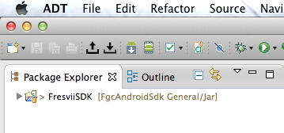
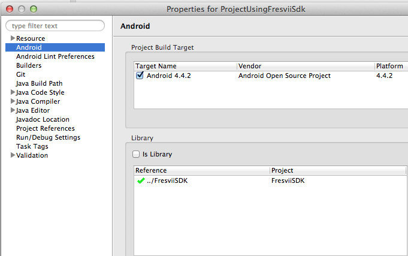

Fresvii Gaming Cloud SDK for Android
=============================

Getting Started
---------------------


Last updated on 2014.06.30

----


1. Create your own Eclipse Android project

2. Add the *FresviiSDK* project to the Eclipse workspace

    

3. Inside your project, within "Project Properties -> Android", reference the *FresviiSDK* project as a Library project.

    

4. Add the following line to your *"project.properties"* file within your own project:

    ```
    manifestmerger.enabled=true
    ```

    This will merge the manifest from the library project into your own manifest.

5. Start the *FresviiSDK* before you interact with it (eg. within *Activity.onCreate()*)

    ```
    Fresvii.start(getContext(), YOUR_FRESVII_APP_ID, YOUR_APP_NAME);
    ```

6. Stop the *FresviiSDK* if you do not need it anymore, in order to free resources (eg. within *Activity.onDestroy()*)

    ```
    Fresvii.stop();
    ```

7. Start the Fresvii Activity to show the Forum:

    ```
    FresviiActivity.start(getContext(), FresviiViewType.FORUM);
    ```

8. Check out the included sample project *"ProjectUsingFresviiSdk"* to see how it's all done.