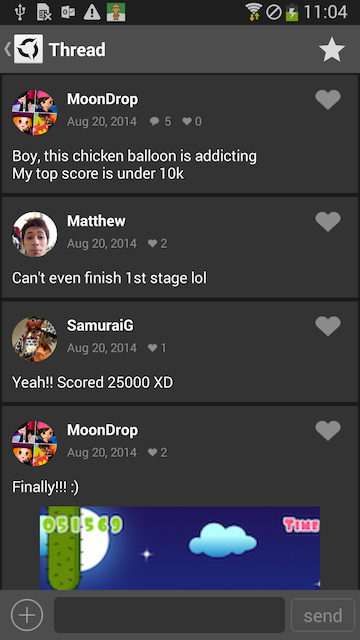

# AppSteroid for Android

## AppSteroid Activities

Last updated on 2014.09.19

---

The AppSteroid comes with a set of default UIs for features such as Forum, Chat, Leaderbaords... This makes it very easy for you to integrate AppSteroid Features into your application, since you don't have to create your own UI from scratch. 

E.g., this is how the default Forum UI looks like:

But of course it is also possible to delevoping your own custom UI that matches your application's look and feel, and tailors to your specific needs. For this purpose, you can use the APIs described in the [Reference Manual](../ReferenceManual/AndroidSDK.md). This document however focuses on the default UIs that ship with the AppSteroid, and how to display those UIs from within your code.

### 1. Add the AppSteroid Activities to your Manifest 

If you wish to use those default UIs (and normally you do), you will have to define the AppSteroid activities in your application's [Manifest](Manifest.md).

### 2. Open a AppSteroid Activity with a single View

To open a AppSteroid Activity with a single view, you can call the corresponding startAndShow... method of the [AppSteroidActivity](../ReferenceManual/AndroidSDK.md#com.fresvii.gui.AppSteroidActivity) class. E.g., to show the Forum you would call:

    AppSteroidActivity.startAndShowForum(getApplicationContext());

And to show the user's own profile you would call:

    AppSteroidActivity.startAndShowEditProfile(getApplicationContext());

### 3. Open a AppSteroid Tabbed Activity with multiple Views

Opening a tabbed activity that contains multiple views is just as easy. Just call the [startTabbedActivity()](../ReferenceManual/AndroidSDK.md#com_fresvii_gui_AppSteroidActivity_void_startTabbedActivity_Context_ShowTabsCollection) method of the [AppSteroidActivity](../ReferenceManual/AndroidSDK.md#com.fresvii.gui.AppSteroidActivity) class, and pass in a [ShowTabsCollection](../ReferenceManual/AndroidSDK.md#com.fresvii.gui.ShowTabsCollection) of the tabs you wish to be displayed.

E.g. if you wish to display both the Forum and the user's own profile in a tabbed Activity, call:

    AppSteroidActivity.startTabbedActivity(
        getApplicationContext(), 
        new ShowTabsCollection(
            TabGroup.FORUM, 
            TabGroup.PROFILE));

Or if you wish to display the Forum, Chat and Leaderboards in a tabbed Activity, call:

    AppSteroidActivity.startTabbedActivity(
        getApplicationContext(), 
        new ShowTabsCollection(
            TabGroup.FORUM, 
            TabGroup.CHAT,
            TabGroup.LEADERBOARD));

Be aware that the tabs will be displayed in the order in which they are passed to the [ShowTabsCollection](../ReferenceManual/AndroidSDK.md#com.fresvii.gui.ShowTabsCollection).
