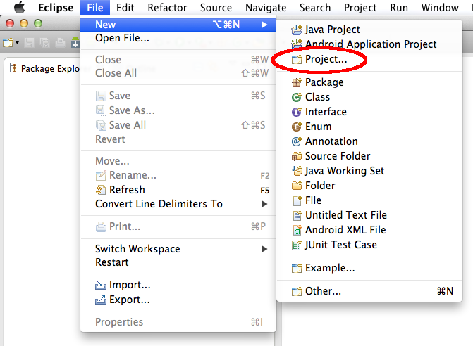
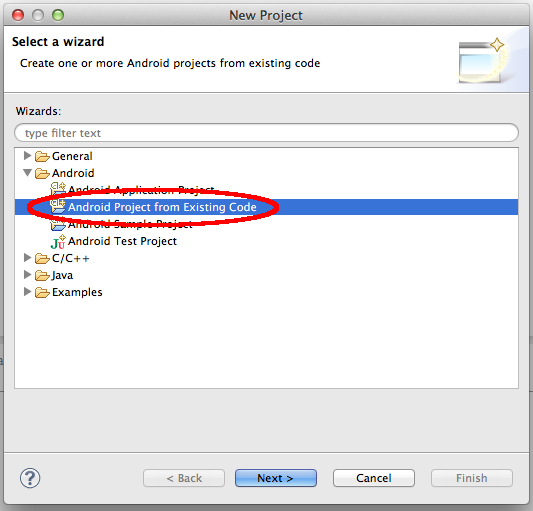
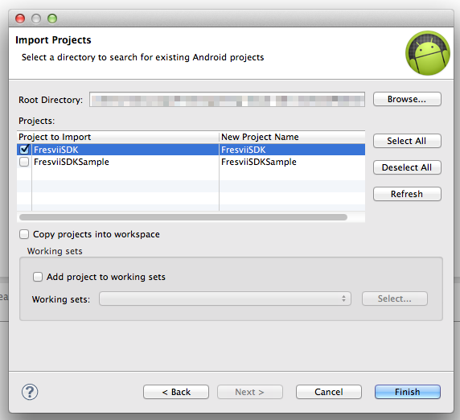
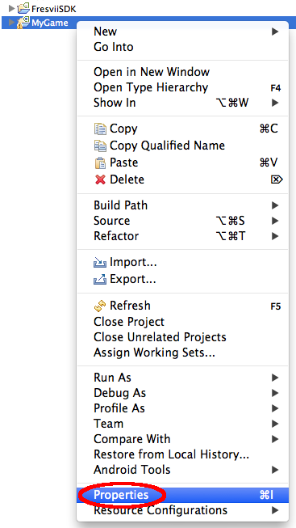
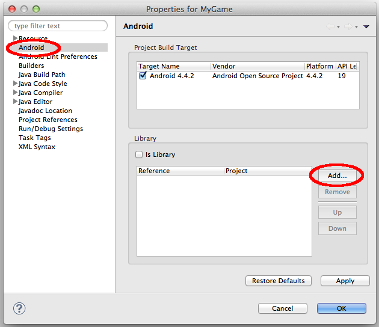
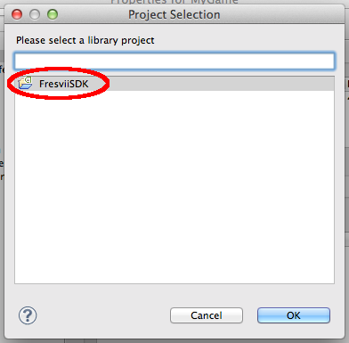

# AppSteroid for Android

## Get started with AppSteroid

Last updated on 2014.09.19

---

### 1. Add the *AppSteroid* project to the Eclipse workspace
    
1.1. Open File > New > Project

1.2. Select "Android Project from Existing Code"

1.3. Specify the folder where you put the AppSteroid files and select the "AppSteroid" project to import. Then click 
"Finish."

### 2. Add the *AppSteroid* library to your project

2.1. Create your own project, e.g. "MyGame"

2.2. Open the properties for your project. 

2.3. On the left, select "Android" and then click on "Add..." to add a library.

2.4. Select the "AppSteroid" library and click on "OK".

### 3. Enable the Manifest Merger

AppSteroid requires several permissions, services and activities to be defined in your application's Manifest. The quickest way to achieve this is to enable the Manifest Merger:

3.1. Add the following line to your *"project.properties"* file within your own project:

    manifestmerger.enabled=true

This will merge the manifest from the library project into your own manifest.

If you wish more fine-grained control over the Manifest, refer to the section [Manifest](Manifest.md).

### 4. Integrate the AppSteroid in your code

4.1. Start the *FAppSteroid* before you interact with it by calling [AppSteroid.start()](../ReferenceManual/AndroidSDK.md#com_fresvii_AppSteroid_void_start_Context_String_String_String_String) (eg. within *Activity.onCreate()*)

    public class MainActivity extends Activity {
        @Override
        protected void onCreate(Bundle savedInstanceState) {
            // Any application must call AppSteroid.start() in order to work with the AppSteroid
            AppSteroid.start(
                    super.getApplicationContext(),
                    MY_APP_ID,
                    MY_APP_SECRET,
                    MY_APP_NAME,
                    MY_GCM_SENDER_ID);
            ...
        }
    }

4.2. Start the AppSteroid Activity to show the Forum:

    AppSteroidActivity.startAndShowForum(getApplicationContext());

### 5. Where to go from here

- Check out the included sample project *"ProjectUsingAppSteroid"* to see how it's all done.
- Learn more about [AppSteroid Activities](AppSteroidActivities.md).
- Read more details about how to set up your application to receive  [GCM Notifications](GcmNotifications.md).
- Read more details about preparing your application's [Manifest](Manifest.md).
- Check out the detailed [Reference Manual](../ReferenceManual/AndroidSDK.md)

