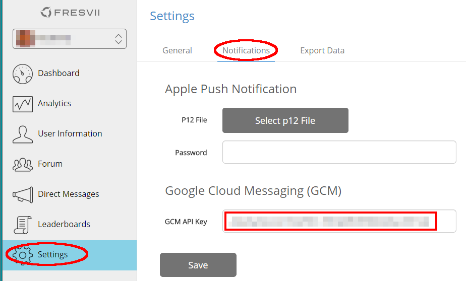

# AppSteroid for Android

## Setting up your application to receive GCM Notifications

Last updated on 2014.10.06

---

This documents describes how you can set up your application to receive GCM Notifications. Unless you have a very specific reason not to, in general you should set up your application to be able to receive GCM Notifications, as they are critical to AppSteroid core features. A lot of AppSteroid's features directly or indirectly depend on GCM Notifications. E.g., the AppSteroid uses GCM Notifications to inform the user about updates when there is a new chat message or a new forum comment. Also, GCM Notifications are used to issue Matchmaking or VoiceChat invitations. While AppSteroid will still run without GCM Notifications, the user experience would be severely diminished.

### 1. Prepare your application's Manifest

#### 1.1. Define Receivers and Services for GCM Notifications in your application's Manifest

You will have to define the following receivers and services in your application's [Manifest](./Manifest.md):

        <!-- This receiver is required by the AppSteroid to receive GCM Notifications -->
        <receiver
                android:name="com.fresvii.gcm.GcmBroadcastReceiver"
                android:permission="com.google.android.c2dm.permission.SEND" >
            <intent-filter>
                <action android:name="com.google.android.c2dm.intent.RECEIVE" />
                <category android:name="com.example.gcm" />
            </intent-filter>
        </receiver>
        
        <!-- This receiver is required by the AppSteroid to react to user actions, such as accepting VoiceChat etc. -->
        <receiver
                android:permission="com.fresvii.gcm.NotificationActionReceiver.permission.ACTION_RECEIVER"
                android:name="com.fresvii.gcm.NotificationActionReceiver" >
            <intent-filter>
                <action android:name="com.fresvii.gcm.NotificationActionReceiver.intent.ACTION_ACCEPT_FRIEND_REQUEST" />
                <action android:name="com.fresvii.gcm.NotificationActionReceiver.intent.ACTION_HIDE_FRIEND_REQUEST" />
                <action android:name="com.fresvii.gcm.NotificationActionReceiver.intent.ACTION_ACCEPT_VOICE_CHAT" />
                <action android:name="com.fresvii.gcm.NotificationActionReceiver.intent.ACTION_CLEAR_NOTIFICATION" />
                <action android:name="com.fresvii.gcm.NotificationActionReceiver.intent.ACTION_ACCEPT_GAME_INVITATION" />
            </intent-filter>
        </receiver>
        
        <!-- This service is required by the AppSteroid to receive GCM Notifications -->
        <service android:name="com.fresvii.gcm.GcmIntentService" />

 If you use the [Manifest Merger](./Manifest.md#ManifestMerger), the above receivers and services will be automatically defined and you can skip this step.

#### 1.2. Define Permissions  for GCM Notifications in your application's Manifest

In order to receive GCM Notifications, you will have to define the following permissions in your application's [Manifest](./Manifest.md):

        <!-- Define permissions for AppSteroid -->
        <permission
            android:name="com.fresvii.gcm.NotificationActionReceiver.permission.ACTION_RECEIVER"
            android:protectionLevel="signature" />
        <permission
            android:name="com.example.gcm.permission.C2D_MESSAGE"
            android:protectionLevel="signature" />
        
        <!-- Permissions required by the AppSteroid -->
        <uses-permission android:name="android.permission.INTERNET"/>
        <uses-permission android:name="android.permission.WRITE_EXTERNAL_STORAGE" />
        <uses-permission android:name="android.permission.RECORD_AUDIO" />
        <uses-permission android:name="android.permission.MODIFY_AUDIO_SETTINGS" />
        <uses-permission android:name="android.permission.GET_ACCOUNTS" />
        <uses-permission android:name="android.permission.GET_TASKS" />
        <uses-permission android:name="android.permission.WAKE_LOCK" />   
        <uses-permission android:name="com.google.android.c2dm.permission.RECEIVE" />
        <uses-permission android:name="com.example.gcm.permission.C2D_MESSAGE" />
        <uses-permission android:name="com.example.gcm.c2dm.permission.RECEIVE" />
        <uses-permission android:name="com.fresvii.gcm.NotificationActionReceiver.permission.ACTION_RECEIVER" />

If you use the [Manifest Merger](./Manifest.md#ManifestMerger), all of the above permissions will be automatically defined and you can skip this step.

### 2. Obtaining *GCM Sender ID* and *GCM API Key* for your application

Follow the instructions [here](https://developer.android.com/google/gcm/gs.html) to obtain a *GCM Sender ID* and *GCM API Key* for your application.

### 3. Enter your GCM API Key in the Fresvii Console

- Log into the [Fresvii Console](https://fresvii.com) and select your application from the dashboard.
- Select "Settings" in the left navigation bar
- Select "Notifications" in the top right pane
- Insert the *GCM API Key* obtained in step 3 in the field "GCM API Key"
- Click "Save"

  

### 4. Pass your GCM Sender ID when starting the AppSteroid

When starting the AppSteroid with the method [AppSteroid.start()](../ReferenceManual/AndroidSDK.md#com_fresvii_AppSteroid_void_start_Context_String_String_String_String), pass in the *GCM Sender ID* obtained in step 3 as argument:

    AppSteroid.start(
          getApplicationContext(),
          MY_APP_ID,
          MY_APP_SECRET,
          MY_APP_NAME,
          MY_GCM_SENDER_ID);  // Put in your GCM Sender ID obtained in step 3!

That's it. Now your application should be able to receive GCM Notifications, and your users may fully enjoy all the advantages of the AppSteroid.
          

### 5. Pause / Resume reception of GCM Notifications

If you follow steps 1. to 4., by default GCM notifications will be delivered to the user's terminal any time, even if the user is in a game, or even when your application is not running. If you wish to temporarily disable reception of GCM notifications while your user is playing a game, or wish to enable reception of GCM notifications only while your app is running, you can use the class [GcmClient](../ReferenceManual/GcmClient.md) to achieve this. It offers two methods, respectively [pause()](../ReferenceManual/GcmClient.md#com_fresvii_gcm_GcmClient_void_pause_GcmClient_PauseCallback) and [resume()](../ReferenceManual/GcmClient.md#com_fresvii_gcm_GcmClient_void_resume_GcmClient_ResumeCallback), for just this purpose.

**Pause Reception of GCM Notifications:**

    	GcmClient.getInstance().pause(new PauseCallback() {
			@Override
			public void onFailure(Throwable error) {
				// TODO: Error Handling
			}
			
			@Override
			public void onSuccess() {
				// Success!
			}
		});
		

**Resume Reception of GCM Notifications:**

    	GcmClient.getInstance().resume(new ResumeCallback() {
			@Override
			public void onFailure(Throwable error) {
				// TODO: Error Handling
			}
			
			@Override
			public void onSuccess() {
				// Success!
			}
		});

