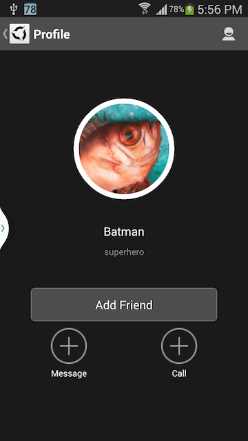

# AppSteroid for Android

## Get started with VoiceChat

Last updated on 2014.09.20

---

### 1. Add the VoiceChat library

Add the VoiceChat library (*libvoicechat.so*) to the *libs/armeabi* folder of you *AppSteroid* project in the Eclipse workspace.

### 2. Prepare your application's Manifest

#### 2.1. Define Receivers and Services for GCM Notifications in your application's Manifest

You will have to define the following receivers and services in your application's [Manifest](./Manifest.md):

        <!-- This receiver is required by the AppSteroid to receive GCM Notifications -->
        <receiver
                android:name="com.fresvii.gcm.GcmBroadcastReceiver"
                android:permission="com.google.android.c2dm.permission.SEND" >
            <intent-filter>
                <action android:name="com.google.android.c2dm.intent.RECEIVE" />
                <category android:name="com.example.gcm" />
            </intent-filter>
        </receiver>
        
        <!-- This receiver is required by the AppSteroid to react to user actions, such as accepting VoiceChat etc. -->
        <receiver
                android:permission="com.fresvii.gcm.NotificationActionReceiver.permission.ACTION_RECEIVER"
                android:name="com.fresvii.gcm.NotificationActionReceiver" >
            <intent-filter>
                <action android:name="com.fresvii.gcm.NotificationActionReceiver.intent.ACTION_ACCEPT_FRIEND_REQUEST" />
                <action android:name="com.fresvii.gcm.NotificationActionReceiver.intent.ACTION_HIDE_FRIEND_REQUEST" />
                <action android:name="com.fresvii.gcm.NotificationActionReceiver.intent.ACTION_ACCEPT_VOICE_CHAT" />
                <action android:name="com.fresvii.gcm.NotificationActionReceiver.intent.ACTION_CLEAR_NOTIFICATION" />
                <action android:name="com.fresvii.gcm.NotificationActionReceiver.intent.ACTION_ACCEPT_GAME_INVITATION" />
            </intent-filter>
        </receiver>
        
        <!-- This service is required by the AppSteroid to receive GCM Notifications -->
        <service android:name="com.fresvii.gcm.GcmIntentService" />

These receivers and services are required to receive GCM notifications for VoiceChat.

If you use the [Manifest Merger](./Manifest.md#ManifestMerger), the above receivers and services will be automatically defined and you can skip this step. Also see the documents "[Receiving GCM Notifications](./GcmNotifications.md)" and "[Manifest](./Manifest.md)"

#### 2.2. Define Permissions  for GCM Notifications in your application's Manifest

In order to receive GCM Notifications, you will have to define the following permissions in your application's [Manifest](./Manifest.md):

        <!-- Define permissions for AppSteroid -->
        <permission
            android:name="com.fresvii.gcm.NotificationActionReceiver.permission.ACTION_RECEIVER"
            android:protectionLevel="signature" />
        <permission
            android:name="com.example.gcm.permission.C2D_MESSAGE"
            android:protectionLevel="signature" />
        
        <!-- Permissions required by the AppSteroid -->
        <uses-permission android:name="android.permission.INTERNET"/>
        <uses-permission android:name="android.permission.WRITE_EXTERNAL_STORAGE" />
        <uses-permission android:name="android.permission.RECORD_AUDIO" />
        <uses-permission android:name="android.permission.MODIFY_AUDIO_SETTINGS" />
        <uses-permission android:name="android.permission.GET_ACCOUNTS" />
        <uses-permission android:name="android.permission.WAKE_LOCK" />   
        <uses-permission android:name="com.google.android.c2dm.permission.RECEIVE" />
        <uses-permission android:name="com.example.gcm.permission.C2D_MESSAGE" />
        <uses-permission android:name="com.example.gcm.c2dm.permission.RECEIVE" />
        <uses-permission android:name="com.fresvii.gcm.NotificationActionReceiver.permission.ACTION_RECEIVER" />

These permissions are required to:

- Receive GCM notifications for VoiceChat. 
- Use the microphone for VoiceChat
- Switch between inner and outer speaker for VoiceChat

If you use the [Manifest Merger](./Manifest.md#ManifestMerger), all of the above permissions will be automatically defined and you can skip this step. Also see the documents "[Receiving GCM Notifications](./GcmNotifications.md)" and "[Manifest](./Manifest.md)"

### 3. Create a AppSteroid Group for VoiceChat

To start a VoiceChat, first you have to create a AppSteroid Group, e.g. a PairGroup: 

    public void hostVoiceChatConference(String partnerUserId) {
        // First, create a Group with the partner(s) you wish to have a VoiceChat conference with
        // Here, we are using a PairGroup for a quick 1 on 1 VoiceChat
        GroupAccess.createPairGroup(partnerUserId, new CreatePairGroupCallback() {
            @Override
            public void onSuccess(AppSteroidGroup group) {
                // Success! The PairGroup has been created.
                // Now you can host a VoiceChat conference. 
                VoiceChatConference.getInstance().host(group.getIdOrDefault(), new VoiceChatConferenceCallback() {
                    @Override
                    public void onSuccess() {
                        // Success! The partner(s) will now receive a GCM VoiceChat notification. 
                        // They can join the conference by accepting the invitation. 
                    }
            
                    @Override
                    public void onError(Throwable error) {
                      // Error handling
                    }
                });
            }
            
            @Override
            public void onFailure(Throwable error) {
                // Error handling
            }
        });
    }

Or, if you want to create a VoiceChat between participants of a [AppSteroidMatch](../ReferenceManual/Matchmaking.md#com.fresvii.components.AppSteroidMatch) initiated via [Matchmaking](../ReferenceManual/Matchmaking.md), you can use one of the Match's [Groups](../ReferenceManual/Matchmaking.md#com_fresvii_components_AppSteroidMatch_java_util_List_getGroups_) to start the VoiceChat!

### 4. Accept VoiceChat invitation

After you hosted the VoiceChat conference, the partner(s) will receive a VoiceChat invitation via GCM notification. They can join the conference by accepting the invitation. 

After accepting the invitation, you should be talking to your VoiceChat partner(s)!

### 5. Leave the VoiceChat

Either participant (host or guests) can leave the VoiceChat conference like this:

    public void leaveVoiceChatConference() {
        VoiceChatConference.getInstance().leave(new VoiceChatConferenceCallback() {
            @Override
            public void onSuccess() {
                // Success
            }
            
            @Override
            public void onError(final Throwable error) {
                // Error handling
            }
        });
    }

### 6. Use the built-in VoiceChat UI:

You can also quickly start a 1 on 1 VoiceChat by clicking the "Call" button in the partner's profile (e.g. in the Forum).
This basically runs the same code as the sample code above.
    

Or, if you are in a Group Chat, you can click the "Call" button in the upper right and start a VoiceChat with up to 4 total participants.

### 7. Where to go from here

- Study the [VoiceChat API](../ReferenceManual/VoiceChat.md) for more fine-grained control of your VoiceChat conferences.

