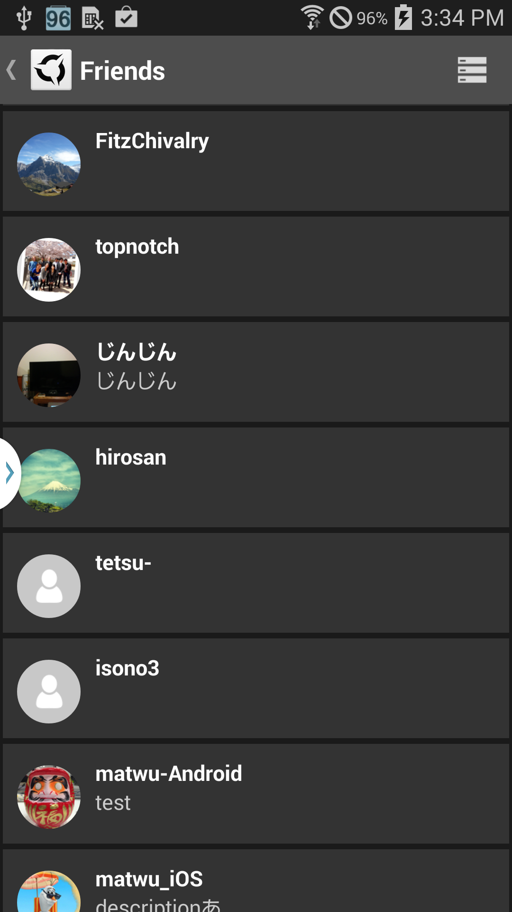

# AppSteroid Friend API

Last updated 2014-12-10

-------------------------

## Introduction

AppSteroid Friend API can be used to manage AppSteroid friend relations. You can send, accept or hide friend requests, retrieve lists of friends, incoming friend requests or outgoing friend requests.

You may also register a [FriendRequestNotificationListener](GcmClient.md#com.fresvii.gcm.FriendRequestNotificationListener) to be informed about new incoming friend requests or updates to outgoing friend requests, but that is optional since the AppSteroid by default will handle these notifications for you.

The easiest way to make use of the Friends feature is via the built in AppSteroid GUI. E.g. you can open the AppSteroid Forum GUI, and befriend a user via his profile.

    AppSteroidActivity.startAndShowForum(getApplicationContext());

Or you can open your own profile, to accept incoming friend requests and see a list of your own friends.

    AppSteroidActivity.startAndShowEditProfile(getApplicationContext());




---  

## Classes

|Class|Description|
|---|---|
|[FriendAccess](#com.fresvii.server.access.FriendAccess)|Provides access to Fresvii Server's Friend API.|
|[GetFriendsCallback](#com.fresvii.server.access.callbacks.friends.GetFriendsCallback)|Callback interface to handle [FriendAccess.getFriends()](#com_fresvii_server_access_FriendAccess_void_getFriends_GetFriendsCallback) results.|
|[GetIncomingFriendRequestsCallback](#com.fresvii.server.access.callbacks.friends.GetIncomingFriendRequestsCallback)|Callback interface to handle [FriendAccess.getIncomingFriendRequests()](#com_fresvii_server_access_FriendAccess_void_getIncomingFriendRequests_GetIncomingFriendRequestsCallback) results.|
|[GetOutgoingFriendRequestsCallback](#com.fresvii.server.access.callbacks.friends.GetOutgoingFriendRequestsCallback)|Callback interface to handle [FriendAccess.getOutgoingFriendRequests()](#com_fresvii_server_access_FriendAccess_void_getOutgoingFriendRequests_GetOutgoingFriendRequestsCallback) results.|
|[SendFriendRequestCallback](#com.fresvii.server.access.callbacks.friends.SendFriendRequestCallback)|Callback interface to handle [FriendAccess.sendFriendRequest()](#com_fresvii_server_access_FriendAccess_void_sendFriendRequest_String_SendFriendRequestCallback) results.|
|[AcceptFriendRequestCallback](#com.fresvii.server.access.callbacks.friends.AcceptFriendRequestCallback)|Callback interface to handle [FriendAccess.acceptFriendRequest()](#com_fresvii_server_access_FriendAccess_void_acceptFriendRequest_String_AcceptFriendRequestCallback) results.|
|[HideFriendRequestCallback](#com.fresvii.server.access.callbacks.friends.HideFriendRequestCallback)|Callback interface to handle [FriendAccess.hideFriendRequest()](#com_fresvii_server_access_FriendAccess_void_hideFriendRequest_String_HideFriendRequestCallback) results.|
|[UnfriendCallback](#com.fresvii.server.access.callbacks.friends.UnfriendCallback)|Callback interface to handle [FriendAccess.unfriend()](#com_fresvii_server_access_FriendAccess_void_unfriend_String_UnfriendCallback) results.|


---  

## <a name="com.fresvii.server.access.FriendAccess"> Class FriendAccess </a>

```
public class FriendAccess extends Object
```

**Hierarchy:**  

```
java.lang.Object  
    com.fresvii.server.access.FriendAccess
```

**Description:**  
Provides access to Fresvii Server's Friend API.  Can be used to retrieve list of friends, request or remove friends, etc.

**Author:**  
Marcus Froeschl

**Version:**  
1.0

**Since:**  
2014-07-15


### Field Summary

|Field|Description|
|---|---|
|NO_PAGE_NUMBER|ID used to specify that the first page should be retrieved|


### Method Summary

|Method|Description|
|---|---|
|[public static void acceptFriendRequest(String userId, AcceptFriendRequestCallback callback)](#com_fresvii_server_access_FriendAccess_void_acceptFriendRequest_String_AcceptFriendRequestCallback)|Accepts a friend request from a user|
|[public static void getAllFriends(GetAllFriendsCallback callback)](#com_fresvii_server_access_FriendAccess_void_getAllFriends_GetAllFriendsCallback)|Retrieves a list of all friends of the current user. This can involve multiple server requests, the caller will only|
|[public static void getAllFriends(GetFriendsCallback intermediaryCallback, GetAllFriendsCallback finalCallback)](#com_fresvii_server_access_FriendAccess_void_getAllFriends_GetFriendsCallback_GetAllFriendsCallback)|Retrieves a list of all friends of the current user. This can involve multiple server requests, the caller will be |
|[public static void getAllFriends(String userId, GetAllFriendsCallback callback)](#com_fresvii_server_access_FriendAccess_void_getAllFriends_String_GetAllFriendsCallback)|Retrieves a list of all friends of the specified user. This can involve multiple server requests, the caller will only|
|[public static void getAllFriends(String userId, GetFriendsCallback intermediaryCallback, GetAllFriendsCallback finalCallback)](#com_fresvii_server_access_FriendAccess_void_getAllFriends_String_GetFriendsCallback_GetAllFriendsCallback)|Retrieves a list of all friends of the specified user. This can involve multiple server requests, the caller will be |
|[public static void getFriends(GetFriendsCallback callback)](#com_fresvii_server_access_FriendAccess_void_getFriends_GetFriendsCallback)|Retrieves a list of Friends for the current user from the initial page.|
|[public static void getFriends(int page, GetFriendsCallback callback)](#com_fresvii_server_access_FriendAccess_void_getFriends_int_GetFriendsCallback)|Retrieves a list of Friends for the current user from the specified page.|
|[public static void getFriends(String userId, GetFriendsCallback callback)](#com_fresvii_server_access_FriendAccess_void_getFriends_String_GetFriendsCallback)|Retrieves a list of Friends for a specific user from the initial page.|
|[public static void getFriends(String userId, int page, GetFriendsCallback callback)](#com_fresvii_server_access_FriendAccess_void_getFriends_String_int_GetFriendsCallback)|Retrieves a list of Friends for a specific user from the specified page.|
|[public static void getIncomingFriendRequests(GetIncomingFriendRequestsCallback callback)](#com_fresvii_server_access_FriendAccess_void_getIncomingFriendRequests_GetIncomingFriendRequestsCallback)|Retrieves a list of incoming friend requests from the initial page.|
|[public static void getIncomingFriendRequests(int page, GetIncomingFriendRequestsCallback callback)](#com_fresvii_server_access_FriendAccess_void_getIncomingFriendRequests_int_GetIncomingFriendRequestsCallback)|Retrieves a list of incoming friend requests from the specified page.|
|[public static void getOutgoingFriendRequests(GetOutgoingFriendRequestsCallback callback)](#com_fresvii_server_access_FriendAccess_void_getOutgoingFriendRequests_GetOutgoingFriendRequestsCallback)|Retrieves a list of outgoing friend requests from the initial page.|
|[public static void getOutgoingFriendRequests(int page, GetOutgoingFriendRequestsCallback callback)](#com_fresvii_server_access_FriendAccess_void_getOutgoingFriendRequests_int_GetOutgoingFriendRequestsCallback)|Retrieves a list of outgoing friend requests from the specified page.|
|[public static void hideFriendRequest(String userId, HideFriendRequestCallback callback)](#com_fresvii_server_access_FriendAccess_void_hideFriendRequest_String_HideFriendRequestCallback)|Hides a friend request from a user|
|[public static void sendFriendRequest(String userId, SendFriendRequestCallback callback)](#com_fresvii_server_access_FriendAccess_void_sendFriendRequest_String_SendFriendRequestCallback)|Sends a friend request to a user|
|[public static void unfriend(String userId, UnfriendCallback callback)](#com_fresvii_server_access_FriendAccess_void_unfriend_String_UnfriendCallback)|Unfriends a user.|


### Method Detail
 


## <a name="com_fresvii_server_access_FriendAccess_void_acceptFriendRequest_String_AcceptFriendRequestCallback"> acceptFriendRequest </a>

```
public static void acceptFriendRequest(String userId,  
                                       AcceptFriendRequestCallback callback)
```

Accepts a friend request from a user

#### Parameters

|Parameter|Description|
|---|---|
|String userId|ID of the user who's friend request should be accepted.|
|[AcceptFriendRequestCallback](#com.fresvii.server.access.callbacks.friends.AcceptFriendRequestCallback) callback|[Callback](#com.fresvii.server.access.callbacks.friends.AcceptFriendRequestCallback) to be informed about the result of the operation.|


## <a name="com_fresvii_server_access_FriendAccess_void_getAllFriends_GetAllFriendsCallback"> getAllFriends </a>

```
public static void getAllFriends(GetAllFriendsCallback callback)
```

Retrieves a list of all friends of the current user. This can involve multiple server requests, the caller will only  be informed of the final result containing the list of all friends of the current user.

#### Parameters

|Parameter|Description|
|---|---|
|GetAllFriendsCallback callback|Callback to be informed about the result of the operation.|


## <a name="com_fresvii_server_access_FriendAccess_void_getAllFriends_GetFriendsCallback_GetAllFriendsCallback"> getAllFriends </a>

```
public static void getAllFriends(GetFriendsCallback intermediaryCallback,  
                                 GetAllFriendsCallback finalCallback)
```

Retrieves a list of all friends of the current user. This can involve multiple server requests, the caller will be   informed of intermediary server results and the final server result containing the list of all friends of the current user.

#### Parameters

|Parameter|Description|
|---|---|
|[GetFriendsCallback](#com.fresvii.server.access.callbacks.friends.GetFriendsCallback) intermediaryCallback|Callback to be informed about an intermediary |
|GetAllFriendsCallback finalCallback|Callback to be informed about the final result of the |


## <a name="com_fresvii_server_access_FriendAccess_void_getAllFriends_String_GetAllFriendsCallback"> getAllFriends </a>

```
public static void getAllFriends(String userId,  
                                 GetAllFriendsCallback callback)
```

Retrieves a list of all friends of the specified user. This can involve multiple server requests, the caller will only  be informed of the final result containing the list of all friends.

#### Parameters

|Parameter|Description|
|---|---|
|String userId|ID of the user who's friends are to be retrieved.|
|GetAllFriendsCallback callback|Callback to be informed about the result of the operation.|


## <a name="com_fresvii_server_access_FriendAccess_void_getAllFriends_String_GetFriendsCallback_GetAllFriendsCallback"> getAllFriends </a>

```
public static void getAllFriends(String userId,  
                                 GetFriendsCallback intermediaryCallback,  
                                 GetAllFriendsCallback finalCallback)
```

Retrieves a list of all friends of the specified user. This can involve multiple server requests, the caller will be   informed of intermediary server results and the final server result containing the list of all friends.

#### Parameters

|Parameter|Description|
|---|---|
|String userId|ID of the user who's friends are to be retrieved.|
|[GetFriendsCallback](#com.fresvii.server.access.callbacks.friends.GetFriendsCallback) intermediaryCallback|Callback to be informed about an intermediary |
|GetAllFriendsCallback finalCallback|Callback to be informed about the final result of the |


## <a name="com_fresvii_server_access_FriendAccess_void_getFriends_GetFriendsCallback"> getFriends </a>

```
public static void getFriends(GetFriendsCallback callback)
```

Retrieves a list of Friends for the current user from the initial page.

#### Parameters

|Parameter|Description|
|---|---|
|[GetFriendsCallback](#com.fresvii.server.access.callbacks.friends.GetFriendsCallback) callback|[Callback](#com.fresvii.server.access.callbacks.friends.GetFriendsCallback) to be informed about the result of the operation.|


## <a name="com_fresvii_server_access_FriendAccess_void_getFriends_int_GetFriendsCallback"> getFriends </a>

```
public static void getFriends(int page,  
                              GetFriendsCallback callback)
```

Retrieves a list of Friends for the current user from the specified page.

#### Parameters

|Parameter|Description|
|---|---|
|int page|Page offset.|
|[GetFriendsCallback](#com.fresvii.server.access.callbacks.friends.GetFriendsCallback) callback|[Callback](#com.fresvii.server.access.callbacks.friends.GetFriendsCallback) to be informed about the result of the operation.|


## <a name="com_fresvii_server_access_FriendAccess_void_getFriends_String_GetFriendsCallback"> getFriends </a>

```
public static void getFriends(String userId,  
                              GetFriendsCallback callback)
```

Retrieves a list of Friends for a specific user from the initial page.

#### Parameters

|Parameter|Description|
|---|---|
|String userId|ID of the user who's friends are to be retrieved.|
|[GetFriendsCallback](#com.fresvii.server.access.callbacks.friends.GetFriendsCallback) callback|[Callback](#com.fresvii.server.access.callbacks.friends.GetFriendsCallback) to be informed about the result of the operation.|


## <a name="com_fresvii_server_access_FriendAccess_void_getFriends_String_int_GetFriendsCallback"> getFriends </a>

```
public static void getFriends(String userId,  
                              int page,  
                              GetFriendsCallback callback)
```

Retrieves a list of Friends for a specific user from the specified page.

#### Parameters

|Parameter|Description|
|---|---|
|String userId|ID of the user who's friends are to be retrieved.|
|int page|Page offset.|
|[GetFriendsCallback](#com.fresvii.server.access.callbacks.friends.GetFriendsCallback) callback|[Callback](#com.fresvii.server.access.callbacks.friends.GetFriendsCallback) to be informed about the result of the operation.|


## <a name="com_fresvii_server_access_FriendAccess_void_getIncomingFriendRequests_GetIncomingFriendRequestsCallback"> getIncomingFriendRequests </a>

```
public static void getIncomingFriendRequests(GetIncomingFriendRequestsCallback callback)
```

Retrieves a list of incoming friend requests from the initial page.

#### Parameters

|Parameter|Description|
|---|---|
|[GetIncomingFriendRequestsCallback](#com.fresvii.server.access.callbacks.friends.GetIncomingFriendRequestsCallback) callback|[Callback](#com.fresvii.server.access.callbacks.friends.GetIncomingFriendRequestsCallback) to be informed about the result of the operation.|


## <a name="com_fresvii_server_access_FriendAccess_void_getIncomingFriendRequests_int_GetIncomingFriendRequestsCallback"> getIncomingFriendRequests </a>

```
public static void getIncomingFriendRequests(int page,  
                                             GetIncomingFriendRequestsCallback callback)
```

Retrieves a list of incoming friend requests from the specified page.

#### Parameters

|Parameter|Description|
|---|---|
|int page|Page offset.|
|[GetIncomingFriendRequestsCallback](#com.fresvii.server.access.callbacks.friends.GetIncomingFriendRequestsCallback) callback|[Callback](#com.fresvii.server.access.callbacks.friends.GetIncomingFriendRequestsCallback) to be informed about the result of the operation.|


## <a name="com_fresvii_server_access_FriendAccess_void_getOutgoingFriendRequests_GetOutgoingFriendRequestsCallback"> getOutgoingFriendRequests </a>

```
public static void getOutgoingFriendRequests(GetOutgoingFriendRequestsCallback callback)
```

Retrieves a list of outgoing friend requests from the initial page.

#### Parameters

|Parameter|Description|
|---|---|
|[GetOutgoingFriendRequestsCallback](#com.fresvii.server.access.callbacks.friends.GetOutgoingFriendRequestsCallback) callback|[Callback](#com.fresvii.server.access.callbacks.friends.GetOutgoingFriendRequestsCallback) to be informed about the result of the operation.|


## <a name="com_fresvii_server_access_FriendAccess_void_getOutgoingFriendRequests_int_GetOutgoingFriendRequestsCallback"> getOutgoingFriendRequests </a>

```
public static void getOutgoingFriendRequests(int page,  
                                             GetOutgoingFriendRequestsCallback callback)
```

Retrieves a list of outgoing friend requests from the specified page.

#### Parameters

|Parameter|Description|
|---|---|
|int page|Page offset.|
|[GetOutgoingFriendRequestsCallback](#com.fresvii.server.access.callbacks.friends.GetOutgoingFriendRequestsCallback) callback|[Callback](#com.fresvii.server.access.callbacks.friends.GetOutgoingFriendRequestsCallback) to be informed about the result of the operation.|


## <a name="com_fresvii_server_access_FriendAccess_void_hideFriendRequest_String_HideFriendRequestCallback"> hideFriendRequest </a>

```
public static void hideFriendRequest(String userId,  
                                     HideFriendRequestCallback callback)
```

Hides a friend request from a user

#### Parameters

|Parameter|Description|
|---|---|
|String userId|ID of the user who's friend request should be hidden.|
|[HideFriendRequestCallback](#com.fresvii.server.access.callbacks.friends.HideFriendRequestCallback) callback|[Callback](#com.fresvii.server.access.callbacks.friends.HideFriendRequestCallback) to be informed about the result of the operation.|


## <a name="com_fresvii_server_access_FriendAccess_void_sendFriendRequest_String_SendFriendRequestCallback"> sendFriendRequest </a>

```
public static void sendFriendRequest(String userId,  
                                     SendFriendRequestCallback callback)
```

Sends a friend request to a user

#### Parameters

|Parameter|Description|
|---|---|
|String userId|ID of the user to send the friend request to.|
|[SendFriendRequestCallback](#com.fresvii.server.access.callbacks.friends.SendFriendRequestCallback) callback|[Callback](#com.fresvii.server.access.callbacks.friends.SendFriendRequestCallback) to be informed about the result of the operation.|


## <a name="com_fresvii_server_access_FriendAccess_void_unfriend_String_UnfriendCallback"> unfriend </a>

```
public static void unfriend(String userId,  
                            UnfriendCallback callback)
```

Unfriends a user.

#### Parameters

|Parameter|Description|
|---|---|
|String userId|ID of the user to unfriend.|
|[UnfriendCallback](#com.fresvii.server.access.callbacks.friends.UnfriendCallback) callback|[Callback](#com.fresvii.server.access.callbacks.friends.UnfriendCallback) to be informed about the result of the operation.|


---  

## <a name="com.fresvii.server.access.callbacks.friends.GetFriendsCallback"> Interface GetFriendsCallback </a>

```
public interface GetFriendsCallback implements FailureCallback
```

**Hierarchy:**  

```
com.fresvii.server.access.callbacks.friends.GetFriendsCallback
```

**Description:**  
Callback interface to handle [FriendAccess.getFriends()](#com_fresvii_server_access_FriendAccess_void_getFriends_GetFriendsCallback) results.

**Author:**  
Marcus Froeschl

**Version:**  
1.1


### Method Summary

|Method|Description|
|---|---|
|[public void onSuccess(AppSteroidListMetaInfo metaInfo, List friends)](#com_fresvii_server_access_callbacks_friends_GetFriendsCallback_void_onSuccess_AppSteroidListMetaInfo_List)|Callback invoked when operation succeeds.|


### Method Detail
 


## <a name="com_fresvii_server_access_callbacks_friends_GetFriendsCallback_void_onSuccess_AppSteroidListMetaInfo_List"> onSuccess </a>

```
public void onSuccess(AppSteroidListMetaInfo metaInfo,  
                      List friends)
```

Callback invoked when operation succeeds.

#### Parameters

|Parameter|Description|
|---|---|
|[AppSteroidListMetaInfo](AndroidSDK.md#com.fresvii.components.AppSteroidListMetaInfo) metaInfo|List meta info.|
|List friends|List of friends retrieved.|


---  

## <a name="com.fresvii.server.access.callbacks.friends.GetIncomingFriendRequestsCallback"> Interface GetIncomingFriendRequestsCallback </a>

```
public interface GetIncomingFriendRequestsCallback implements FailureCallback
```

**Hierarchy:**  

```
com.fresvii.server.access.callbacks.friends.GetIncomingFriendRequestsCallback
```

**Description:**  
Callback interface to handle [FriendAccess.getIncomingFriendRequests()](#com_fresvii_server_access_FriendAccess_void_getIncomingFriendRequests_GetIncomingFriendRequestsCallback) results.

**Author:**  
Marcus Froeschl

**Version:**  
1.1


### Method Summary

|Method|Description|
|---|---|
|[public void onSuccess(AppSteroidListMetaInfo metaInfo, List users)](#com_fresvii_server_access_callbacks_friends_GetIncomingFriendRequestsCallback_void_onSuccess_AppSteroidListMetaInfo_List)|Callback invoked when operation succeeds.|


### Method Detail
 


## <a name="com_fresvii_server_access_callbacks_friends_GetIncomingFriendRequestsCallback_void_onSuccess_AppSteroidListMetaInfo_List"> onSuccess </a>

```
public void onSuccess(AppSteroidListMetaInfo metaInfo,  
                      List users)
```

Callback invoked when operation succeeds.

#### Parameters

|Parameter|Description|
|---|---|
|[AppSteroidListMetaInfo](AndroidSDK.md#com.fresvii.components.AppSteroidListMetaInfo) metaInfo|List meta info.|
|List users|List of users who want to be our friend.|


---  

## <a name="com.fresvii.server.access.callbacks.friends.GetOutgoingFriendRequestsCallback"> Interface GetOutgoingFriendRequestsCallback </a>

```
public interface GetOutgoingFriendRequestsCallback implements FailureCallback
```

**Hierarchy:**  

```
com.fresvii.server.access.callbacks.friends.GetOutgoingFriendRequestsCallback
```

**Description:**  
Callback interface to handle [FriendAccess.getOutgoingFriendRequests()](#com_fresvii_server_access_FriendAccess_void_getOutgoingFriendRequests_GetOutgoingFriendRequestsCallback) results.

**Author:**  
Marcus Froeschl

**Version:**  
1.1


### Method Summary

|Method|Description|
|---|---|
|[public void onSuccess(AppSteroidListMetaInfo metaInfo, List users)](#com_fresvii_server_access_callbacks_friends_GetOutgoingFriendRequestsCallback_void_onSuccess_AppSteroidListMetaInfo_List)|Callback invoked when operation succeeds.|


### Method Detail
 


## <a name="com_fresvii_server_access_callbacks_friends_GetOutgoingFriendRequestsCallback_void_onSuccess_AppSteroidListMetaInfo_List"> onSuccess </a>

```
public void onSuccess(AppSteroidListMetaInfo metaInfo,  
                      List users)
```

Callback invoked when operation succeeds.

#### Parameters

|Parameter|Description|
|---|---|
|[AppSteroidListMetaInfo](AndroidSDK.md#com.fresvii.components.AppSteroidListMetaInfo) metaInfo|List meta info.|
|List users|List of users to whom we have sent a friend request.|


---  

## <a name="com.fresvii.server.access.callbacks.friends.SendFriendRequestCallback"> Interface SendFriendRequestCallback </a>

```
public interface SendFriendRequestCallback implements FailureCallback
```

**Hierarchy:**  

```
com.fresvii.server.access.callbacks.friends.SendFriendRequestCallback
```

**Description:**  
Callback interface to handle [FriendAccess.sendFriendRequest()](#com_fresvii_server_access_FriendAccess_void_sendFriendRequest_String_SendFriendRequestCallback) results.

**Author:**  
Marcus Froeschl

**Version:**  
1.0


### Method Summary

|Method|Description|
|---|---|
|[public void onSuccess(AppSteroidUser user)](#com_fresvii_server_access_callbacks_friends_SendFriendRequestCallback_void_onSuccess_AppSteroidUser)|Callback invoked when operation succeeds.|


### Method Detail
 


## <a name="com_fresvii_server_access_callbacks_friends_SendFriendRequestCallback_void_onSuccess_AppSteroidUser"> onSuccess </a>

```
public void onSuccess(AppSteroidUser user)
```

Callback invoked when operation succeeds.

#### Parameters

|Parameter|Description|
|---|---|
|[AppSteroidUser](User.md#com.fresvii.components.AppSteroidUser) user|The user who's friendship was requested.|


---  

## <a name="com.fresvii.server.access.callbacks.friends.AcceptFriendRequestCallback"> Interface AcceptFriendRequestCallback </a>

```
public interface AcceptFriendRequestCallback implements FailureCallback
```

**Hierarchy:**  

```
com.fresvii.server.access.callbacks.friends.AcceptFriendRequestCallback
```

**Description:**  
Callback interface to handle [FriendAccess.acceptFriendRequest()](#com_fresvii_server_access_FriendAccess_void_acceptFriendRequest_String_AcceptFriendRequestCallback) results.

**Author:**  
Marcus Froeschl

**Version:**  
1.0


### Method Summary

|Method|Description|
|---|---|
|[public void onSuccess(AppSteroidUser user)](#com_fresvii_server_access_callbacks_friends_AcceptFriendRequestCallback_void_onSuccess_AppSteroidUser)|Callback invoked when operation succeeds.|


### Method Detail
 


## <a name="com_fresvii_server_access_callbacks_friends_AcceptFriendRequestCallback_void_onSuccess_AppSteroidUser"> onSuccess </a>

```
public void onSuccess(AppSteroidUser user)
```

Callback invoked when operation succeeds.

#### Parameters

|Parameter|Description|
|---|---|
|[AppSteroidUser](User.md#com.fresvii.components.AppSteroidUser) user|The friend who was accepted.|


---  

## <a name="com.fresvii.server.access.callbacks.friends.HideFriendRequestCallback"> Interface HideFriendRequestCallback </a>

```
public interface HideFriendRequestCallback implements FailureCallback
```

**Hierarchy:**  

```
com.fresvii.server.access.callbacks.friends.HideFriendRequestCallback
```

**Description:**  
Callback interface to handle [FriendAccess.hideFriendRequest()](#com_fresvii_server_access_FriendAccess_void_hideFriendRequest_String_HideFriendRequestCallback) results.

**Author:**  
Marcus Froeschl

**Version:**  
1.0


### Method Summary

|Method|Description|
|---|---|
|[public void onSuccess(AppSteroidUser user)](#com_fresvii_server_access_callbacks_friends_HideFriendRequestCallback_void_onSuccess_AppSteroidUser)|Callback invoked when operation succeeds.|


### Method Detail
 


## <a name="com_fresvii_server_access_callbacks_friends_HideFriendRequestCallback_void_onSuccess_AppSteroidUser"> onSuccess </a>

```
public void onSuccess(AppSteroidUser user)
```

Callback invoked when operation succeeds.

#### Parameters

|Parameter|Description|
|---|---|
|[AppSteroidUser](User.md#com.fresvii.components.AppSteroidUser) user|The friend who was hidden.|


---  

## <a name="com.fresvii.server.access.callbacks.friends.UnfriendCallback"> Interface UnfriendCallback </a>

```
public interface UnfriendCallback implements FailureCallback
```

**Hierarchy:**  

```
com.fresvii.server.access.callbacks.friends.UnfriendCallback
```

**Description:**  
Callback interface to handle [FriendAccess.unfriend()](#com_fresvii_server_access_FriendAccess_void_unfriend_String_UnfriendCallback) results.

**Author:**  
Marcus Froeschl

**Version:**  
1.0


### Method Summary

|Method|Description|
|---|---|
|[public void onSuccess()](#com_fresvii_server_access_callbacks_friends_UnfriendCallback_void_onSuccess_)|Callback invoked when operation succeeds.|


### Method Detail
 


## <a name="com_fresvii_server_access_callbacks_friends_UnfriendCallback_void_onSuccess_"> onSuccess </a>

```
public void onSuccess()
```

Callback invoked when operation succeeds.


