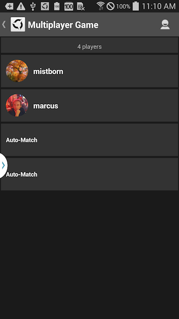

# AppSteroid Matchmaking API

Last updated 2014-10-08

-------------------------

## Introduction

AppSteroid Matchmaking API can be used to initiate matchmaking. You can create a matchmaking request, accept matchmaking invitations, retrieve lists of matching and ongoing matches etc.

The easiest way to make use of the Matchmaking feature is via the built in AppSteroid GUI. E.g. you can open the AppSteroid Matchmaking GUI, which will also start a [MatchmakingSession](#com.fresvii.helper.MatchmakingSession) that will handle the matchmaking for you.


    AppSteroidActivity.startAndShowMatchmaking(getApplicationContext());



Use [AppSteroid.setMatchmakingPlayerCount()](AndroidSDK.md#com_fresvii_AppSteroid_void_setMatchmakingPlayerCount_int) to specify how many players you wish to partake in the match:

    AppSteroid.setMatchmakingPlayerCount(4);

The application should register a [MatchmakingSession.MatchmakingSessionListener](#com.fresvii.helper.MatchmakingSession.MatchmakingSessionListener) to be informed when the match is complete. Once the match is complete, you should start your game.

    public class MyGame extends Activity implements MatchmakingSessionListener {
        @Override
        protected void onCreate(Bundle savedInstanceState) {
            // Any application must call AppSteroid.start() in order to work with the AppSteroid Android SDK
            AppSteroid.start(
            	    super.getApplicationContext(),
            	    MY_APP_ID,
            	    MY_APP_SECRET,
            	    MY_APP_NAME,
            	    MY_GCM_SENDER_ID);
    
            ...
        }
    
        // call this method to start the matchmaking
        public void startMatchmaking() {
            // Specify how many players you wish to match (2-16)
            AppSteroid.setMatchmakingPlayerCount(2);
            
            // Add yourself as MatchmakingSessionListener
            MatchmakingSession.addSessionListener(this);
    
            // Start the matchmaking GUI (This will also start the MatchmakingSession)
            AppSteroidActivity.start(getApplicationContext(), AppSteroidViewType.MATCH_MAKING);
        }
        
        @Override
        public void onMatchmakingSessionStarted() {
        }
        
        @Override
        public void onMatchmakingSessionCreationFailed() {
        }
        
        @Override
        public void onMatchmakingSessionCreated(AppSteroidMatchmakingRequest request, AppSteroidMatch match) {
        }
        
        @Override
        public void onMatchmakingSessionUpdated(AppSteroidMatch match) {
        }
        
        @Override
        public void onMatchmakingSessionCanceled() {
        }
        
        @Override
        public void onMatchmakingSessionCompleted(AppSteroidMatch match) {
            // You should start your game here, when the match was completed.
        }
        
        @Override
        public void onMatchmakingSessionStoppedAndListenerRemoved() {
        }
    }


---  

## Classes

|Class|Description|
|---|---|
|[MatchmakingSession](#com.fresvii.helper.MatchmakingSession)|Class to help run a matchmaking session. Allows starting and canceling a session and getting informed|
|[MatchmakingSession.MatchmakingSessionListener](#com.fresvii.helper.MatchmakingSession.MatchmakingSessionListener)|Listener for updates of the current matchmaking session.|
|[MatchmakingSession.MatchmakingSessionStatus](#com.fresvii.helper.MatchmakingSession.MatchmakingSessionStatus)|State of the current matchmaking session. |
|[MatchmakingAccess](#com.fresvii.server.access.MatchmakingAccess)|Provides access to Fresvii Server's Matchmaking API.|
|[AppSteroidMatch](#com.fresvii.components.AppSteroidMatch)|Represents a Fresvii Match|
|[AppSteroidMatch.MatchStatus](#com.fresvii.components.AppSteroidMatch.MatchStatus)|The match's status.|
|[AppSteroidMatchmakingInvitation](#com.fresvii.components.AppSteroidMatchmakingInvitation)|Represents a Fresvii Match|
|[AppSteroidMatchmakingInvitation.InvitationStatus](#com.fresvii.components.AppSteroidMatchmakingInvitation.InvitationStatus)|The invitation's status.|
|[AppSteroidPlayer](#com.fresvii.components.AppSteroidPlayer)|Represents a Fresvii Player|
|[AppSteroidGameContext](#com.fresvii.components.AppSteroidGameContext)|Represents a Fresvii Game Context|
|[CreateMatchmakingRequestCallback](#com.fresvii.server.access.callbacks.matchmaking.CreateMatchmakingRequestCallback)|Callback interface to handle [MatchmakingAccess.createMatchmakingRequest()](#com_fresvii_server_access_MatchmakingAccess_void_createMatchmakingRequest_Integer_Integer_List_String_String_CreateMatchmakingRequestCallback) results.|
|[CancelMatchmakingRequestCallback](#com.fresvii.server.access.callbacks.matchmaking.CancelMatchmakingRequestCallback)|Callback interface to handle [MatchmakingAccess.cancelMatchmakingRequest()](#com_fresvii_server_access_MatchmakingAccess_void_cancelMatchmakingRequest_String_CancelMatchmakingRequestCallback) results.|
|[GetMatchmakingRequestCallback](#com.fresvii.server.access.callbacks.matchmaking.GetMatchmakingRequestCallback)|Callback interface to handle [MatchmakingAccess.getMatchmakingRequest()](#com_fresvii_server_access_MatchmakingAccess_void_getMatchmakingRequest_GetMatchmakingRequestCallback) results.|
|[AddInvitationToMatchmakingRequestCallback](#com.fresvii.server.access.callbacks.matchmaking.AddInvitationToMatchmakingRequestCallback)|Callback interface to handle [MatchmakingAccess.addInvitationToMatchmakingRequest()](#com_fresvii_server_access_MatchmakingAccess_void_addInvitationToMatchmakingRequest_String_String_String_AddInvitationToMatchmakingRequestCallback) results.|
|[AcceptMatchmakingInvitationCallback](#com.fresvii.server.access.callbacks.matchmaking.AcceptMatchmakingInvitationCallback)|Callback interface to handle [MatchmakingAccess.acceptMatchmakingInvitation()](#com_fresvii_server_access_MatchmakingAccess_void_acceptMatchmakingInvitation_String_AcceptMatchmakingInvitationCallback) results.|
|[GetMatchesCallback](#com.fresvii.server.access.callbacks.matchmaking.GetMatchesCallback)|Callback interface to handle [MatchmakingAccess.getMatches()](#com_fresvii_server_access_MatchmakingAccess_void_getMatches_String_GetMatchesCallback) results.|
|[GetMatchCallback](#com.fresvii.server.access.callbacks.matchmaking.GetMatchCallback)|Callback interface to handle [MatchmakingAccess.getMatch()](#com_fresvii_server_access_MatchmakingAccess_void_getMatch_String_GetMatchCallback) results.|
|[JoinMatchCallback](#com.fresvii.server.access.callbacks.matchmaking.JoinMatchCallback)|Callback interface to handle [MatchmakingAccess.joinMatch()](#com_fresvii_server_access_MatchmakingAccess_void_joinMatch_String_JoinMatchCallback) results.|
|[EndMatchCallback](#com.fresvii.server.access.callbacks.matchmaking.EndMatchCallback)|Callback interface to handle [MatchmakingAccess.endMatch()](#com_fresvii_server_access_MatchmakingAccess_void_endMatch_String_EndMatchCallback) results.|
|[GetGameContextCallback](#com.fresvii.server.access.callbacks.matchmaking.GetGameContextCallback)|Callback interface to handle [MatchmakingAccess.getGameContext()](#com_fresvii_server_access_MatchmakingAccess_void_getGameContext_String_GetGameContextCallback) results.|
|[UpdateGameContextCallback](#com.fresvii.server.access.callbacks.matchmaking.UpdateGameContextCallback)|Callback interface to handle [MatchmakingAccess.updateGameContext()](#com_fresvii_server_access_MatchmakingAccess_void_updateGameContext_String_Map_String_Integer_UpdateGameContextCallback) results.|


---  

## <a name="com.fresvii.helper.MatchmakingSession"> Class MatchmakingSession </a>

```
public class MatchmakingSession extends Object
```

**Hierarchy:**  

```
java.lang.Object  
    com.fresvii.helper.MatchmakingSession
```

**Description:**  
Class to help run a matchmaking session. Allows starting and canceling a session and getting informed  about status updates.  Usually you only have to call the [startIfNotAlreadyRunning()()](#com_fresvii_helper_MatchmakingSession_boolean_startIfNotAlreadyRunning_) method and provide a   [MatchmakingSession.MatchmakingSessionListener](#com.fresvii.helper.MatchmakingSession.MatchmakingSessionListener) to get informed of updates.  To specify the player count used for matchmaking use [Fresvii.setMatchmakingPlayerCount()()](AndroidSDK.md#com_fresvii_AppSteroid_void_setMatchmakingPlayerCount_int).

**Author:**  
mkollmer

**Version:**  
1.0

**Since:**  
2014-08-20


### Method Summary

|Method|Description|
|---|---|
|[public static void addSessionListener(MatchmakingSession.MatchmakingSessionListener sessionListener)](#com_fresvii_helper_MatchmakingSession_void_addSessionListener_MatchmakingSession_MatchmakingSessionListener)|Add a session listener to be informed about future updates to the current matchmaking session |
|[public static void cancel()](#com_fresvii_helper_MatchmakingSession_void_cancel_)|Cancels an existing matchmaking session. |
|[public static AppSteroidMatch getMatch()](#com_fresvii_helper_MatchmakingSession_com_fresvii_components_AppSteroidMatch_getMatch_)|Retrieve an object containing information about the current match situation.|
|[public static MatchmakingSession.MatchmakingSessionStatus getSessionStatus()](#com_fresvii_helper_MatchmakingSession_com_fresvii_helper_MatchmakingSession_MatchmakingSessionStatus_getSessionStatus_)|Retrieve the current matchmaking session status. |
|[public static void removeSessionListener(MatchmakingSession.MatchmakingSessionListener sessionListener)](#com_fresvii_helper_MatchmakingSession_void_removeSessionListener_MatchmakingSession_MatchmakingSessionListener)|Removes a session listener listening for the current matchmaking session. |
|[public static boolean startIfNotAlreadyRunning()](#com_fresvii_helper_MatchmakingSession_boolean_startIfNotAlreadyRunning_)|Starts a matchmaking session. If a session already exists nothing will happen.|
|[public static boolean startIfNotAlreadyRunning(MatchmakingSession.MatchmakingSessionListener sessionListener)](#com_fresvii_helper_MatchmakingSession_boolean_startIfNotAlreadyRunning_MatchmakingSession_MatchmakingSessionListener)|Starts a matchmaking session. |


### Method Detail
 


## <a name="com_fresvii_helper_MatchmakingSession_void_addSessionListener_MatchmakingSession_MatchmakingSessionListener"> addSessionListener </a>

```
public static void addSessionListener(MatchmakingSession.MatchmakingSessionListener sessionListener)
```

Add a session listener to be informed about future updates to the current matchmaking session   This can also be called when no session is active yet, callbacks will then be received once the next session starts.

#### Parameters

|Parameter|Description|
|---|---|
|[MatchmakingSession.MatchmakingSessionListener](#com.fresvii.helper.MatchmakingSession.MatchmakingSessionListener) sessionListener|The [MatchmakingSession.MatchmakingSessionListener](#com.fresvii.helper.MatchmakingSession.MatchmakingSessionListener).|


## <a name="com_fresvii_helper_MatchmakingSession_void_cancel_"> cancel </a>

```
public static void cancel()
```

Cancels an existing matchmaking session.   Nothing will happen if no session is active.


## <a name="com_fresvii_helper_MatchmakingSession_com_fresvii_components_AppSteroidMatch_getMatch_"> getMatch </a>

```
public static AppSteroidMatch getMatch()
```

Retrieve an object containing information about the current match situation.  Will return null if no session is active.

#### Returns

|Return Type|Description|
|---|---|
|AppSteroidMatch|-|


## <a name="com_fresvii_helper_MatchmakingSession_com_fresvii_helper_MatchmakingSession_MatchmakingSessionStatus_getSessionStatus_"> getSessionStatus </a>

```
public static MatchmakingSession.MatchmakingSessionStatus getSessionStatus()
```

Retrieve the current matchmaking session status.   If no session is or was active the status is MatchmakingSession.MatchmakingSessionStatus.STOPPED.

#### Returns

|Return Type|Description|
|---|---|
|MatchmakingSession.MatchmakingSessionStatus|{@link MatchmakingSessionStatus} The current matchmaking session status or {@link MatchmakingSessionStatus#STOPPED} if no session is active|


## <a name="com_fresvii_helper_MatchmakingSession_void_removeSessionListener_MatchmakingSession_MatchmakingSessionListener"> removeSessionListener </a>

```
public static void removeSessionListener(MatchmakingSession.MatchmakingSessionListener sessionListener)
```

Removes a session listener listening for the current matchmaking session.   Be aware that you do not have to remove a listener if a session stopped, as all listeners are automatically removed at the end of a session.

#### Parameters

|Parameter|Description|
|---|---|
|[MatchmakingSession.MatchmakingSessionListener](#com.fresvii.helper.MatchmakingSession.MatchmakingSessionListener) sessionListener|[MatchmakingSession.MatchmakingSessionListener](#com.fresvii.helper.MatchmakingSession.MatchmakingSessionListener) that should get removed.|


## <a name="com_fresvii_helper_MatchmakingSession_boolean_startIfNotAlreadyRunning_"> startIfNotAlreadyRunning </a>

```
public static boolean startIfNotAlreadyRunning()
```

Starts a matchmaking session. If a session already exists nothing will happen.

#### Returns

|Return Type|Description|
|---|---|
|boolean|-|


## <a name="com_fresvii_helper_MatchmakingSession_boolean_startIfNotAlreadyRunning_MatchmakingSession_MatchmakingSessionListener"> startIfNotAlreadyRunning </a>

```
public static boolean startIfNotAlreadyRunning(MatchmakingSession.MatchmakingSessionListener sessionListener)
```

Starts a matchmaking session.   If a session already exists the existing session will not be not altered.   Automatically registers a listener for session status events, even if the session already was running.

#### Parameters

|Parameter|Description|
|---|---|
|[MatchmakingSession.MatchmakingSessionListener](#com.fresvii.helper.MatchmakingSession.MatchmakingSessionListener) sessionListener|The [MatchmakingSession.MatchmakingSessionListener](#com.fresvii.helper.MatchmakingSession.MatchmakingSessionListener) for future session state callbacks.|


#### Returns

|Return Type|Description|
|---|---|
|boolean|-|


---  

## <a name="com.fresvii.helper.MatchmakingSession.MatchmakingSessionListener"> Interface MatchmakingSession.MatchmakingSessionListener </a>

```
public static interface MatchmakingSession.MatchmakingSessionListener
```

**Hierarchy:**  

```
com.fresvii.helper.MatchmakingSession.MatchmakingSessionListener
```

**Description:**  
Listener for updates of the current matchmaking session.


### Method Summary

|Method|Description|
|---|---|
|[public void onMatchmakingSessionCanceled()](#com_fresvii_helper_MatchmakingSession_MatchmakingSessionListener_void_onMatchmakingSessionCanceled_)|This method is invoked when the matchmaking session got cancelled. |
|[public void onMatchmakingSessionCompleted(AppSteroidMatch match)](#com_fresvii_helper_MatchmakingSession_MatchmakingSessionListener_void_onMatchmakingSessionCompleted_AppSteroidMatch)|This method is invoked when the matchmaking has finished successfully.|
|[public void onMatchmakingSessionCreated(AppSteroidMatchmakingRequest request, AppSteroidMatch match)](#com_fresvii_helper_MatchmakingSession_MatchmakingSessionListener_void_onMatchmakingSessionCreated_AppSteroidMatchmakingRequest_AppSteroidMatch)|This method is invoked when the matchmaking session was created on the Fresvii Server. |
|[public void onMatchmakingSessionCreationFailed()](#com_fresvii_helper_MatchmakingSession_MatchmakingSessionListener_void_onMatchmakingSessionCreationFailed_)|There was an error while creating the matchmaking request or while communicating with the Fresvii server to setup the request.|
|[public void onMatchmakingSessionStarted()](#com_fresvii_helper_MatchmakingSession_MatchmakingSessionListener_void_onMatchmakingSessionStarted_)|This method is invoked when the matchmaking session just started. |
|[public void onMatchmakingSessionStoppedAndListenerRemoved()](#com_fresvii_helper_MatchmakingSession_MatchmakingSessionListener_void_onMatchmakingSessionStoppedAndListenerRemoved_)|This method is invoked when the current matchmaking session stopped. |
|[public void onMatchmakingSessionUpdated(AppSteroidMatch match)](#com_fresvii_helper_MatchmakingSession_MatchmakingSessionListener_void_onMatchmakingSessionUpdated_AppSteroidMatch)|This method is invoked when the associated match was updated, e.g. because a new player joined the match.|


### Method Detail
 


## <a name="com_fresvii_helper_MatchmakingSession_MatchmakingSessionListener_void_onMatchmakingSessionCanceled_"> onMatchmakingSessionCanceled </a>

```
public void onMatchmakingSessionCanceled()
```

This method is invoked when the matchmaking session got cancelled.   There will be no further updates. This will be followed by the [MatchmakingSession.MatchmakingSessionListener.onMatchmakingSessionStoppedAndListenerRemoved()](#com_fresvii_helper_MatchmakingSession_MatchmakingSessionListener_void_onMatchmakingSessionStoppedAndListenerRemoved_) callback.


## <a name="com_fresvii_helper_MatchmakingSession_MatchmakingSessionListener_void_onMatchmakingSessionCompleted_AppSteroidMatch"> onMatchmakingSessionCompleted </a>

```
public void onMatchmakingSessionCompleted(AppSteroidMatch match)
```

This method is invoked when the matchmaking has finished successfully.  The game should start now.   This will be followed by the [MatchmakingSession.MatchmakingSessionListener.onMatchmakingSessionStoppedAndListenerRemoved()](#com_fresvii_helper_MatchmakingSession_MatchmakingSessionListener_void_onMatchmakingSessionStoppedAndListenerRemoved_) callback.

#### Parameters

|Parameter|Description|
|---|---|
|[AppSteroidMatch](#com.fresvii.components.AppSteroidMatch) match|The associated [FresviiMatch](#com.fresvii.components.AppSteroidMatch).|


## <a name="com_fresvii_helper_MatchmakingSession_MatchmakingSessionListener_void_onMatchmakingSessionCreated_AppSteroidMatchmakingRequest_AppSteroidMatch"> onMatchmakingSessionCreated </a>

```
public void onMatchmakingSessionCreated(AppSteroidMatchmakingRequest request,  
                                        AppSteroidMatch match)
```

This method is invoked when the matchmaking session was created on the Fresvii Server.   There will be continuous updates until the matchmaking session is completed or gets canceled.

#### Parameters

|Parameter|Description|
|---|---|
|AppSteroidMatchmakingRequest request|The FresviiMatchmakingRequest.|
|[AppSteroidMatch](#com.fresvii.components.AppSteroidMatch) match|The associated [FresviiMatch](#com.fresvii.components.AppSteroidMatch).|


## <a name="com_fresvii_helper_MatchmakingSession_MatchmakingSessionListener_void_onMatchmakingSessionCreationFailed_"> onMatchmakingSessionCreationFailed </a>

```
public void onMatchmakingSessionCreationFailed()
```

There was an error while creating the matchmaking request or while communicating with the Fresvii server to setup the request.


## <a name="com_fresvii_helper_MatchmakingSession_MatchmakingSessionListener_void_onMatchmakingSessionStarted_"> onMatchmakingSessionStarted </a>

```
public void onMatchmakingSessionStarted()
```

This method is invoked when the matchmaking session just started.   There has not been any communication with the Fresvii server so far.   Next callbacks will be [MatchmakingSession.MatchmakingSessionListener.onMatchmakingSessionCreationFailed()](#com_fresvii_helper_MatchmakingSession_MatchmakingSessionListener_void_onMatchmakingSessionCreationFailed_) or   [onMatchmakingSessionCreated()()](#com_fresvii_helper_MatchmakingSession_MatchmakingSessionListener_void_onMatchmakingSessionCreated_AppSteroidMatchmakingRequest_AppSteroidMatch)


## <a name="com_fresvii_helper_MatchmakingSession_MatchmakingSessionListener_void_onMatchmakingSessionStoppedAndListenerRemoved_"> onMatchmakingSessionStoppedAndListenerRemoved </a>

```
public void onMatchmakingSessionStoppedAndListenerRemoved()
```

This method is invoked when the current matchmaking session stopped.   This listener automatically gets removed.   There will be no further callbacks.


## <a name="com_fresvii_helper_MatchmakingSession_MatchmakingSessionListener_void_onMatchmakingSessionUpdated_AppSteroidMatch"> onMatchmakingSessionUpdated </a>

```
public void onMatchmakingSessionUpdated(AppSteroidMatch match)
```

This method is invoked when the associated match was updated, e.g. because a new player joined the match.

#### Parameters

|Parameter|Description|
|---|---|
|[AppSteroidMatch](#com.fresvii.components.AppSteroidMatch) match|The associated [FresviiMatch](#com.fresvii.components.AppSteroidMatch).|


---  

## <a name="com.fresvii.helper.MatchmakingSession.MatchmakingSessionStatus"> Enum MatchmakingSession.MatchmakingSessionStatus </a>

```
public static final class MatchmakingSession.MatchmakingSessionStatus extends Enum
```

**Hierarchy:**  

```
java.lang.Object  
    java.lang.Enum  
        com.fresvii.helper.MatchmakingSession.MatchmakingSessionStatus
```

**Description:**  
State of the current matchmaking session.   If no session was started yet the status is MatchmakingSession.MatchmakingSessionStatus.STOPPED.


### Field Summary

|Field|Description|
|---|---|
|CREATION_PENDING|The matchmaking session was started and the request is currently being processed and negotiated with the server.|
|RUNNING|The matchmaking session is registered at the server and is running.|
|STOPPED|The current request stopped or there was no request yet.|


---  

## <a name="com.fresvii.server.access.MatchmakingAccess"> Class MatchmakingAccess </a>

```
public class MatchmakingAccess extends Object
```

**Hierarchy:**  

```
java.lang.Object  
    com.fresvii.server.access.MatchmakingAccess
```

**Description:**  
Provides access to Fresvii Server's Matchmaking API.  Can be used to send, accept, or cancel matchmake invitations.

**Author:**  
Marcus Froeschl

**Version:**  
1.0

**Since:**  
2014-07-15


### Method Summary

|Method|Description|
|---|---|
|[public static void acceptMatchmakingInvitation(String matchmakingInvitationId, AcceptMatchmakingInvitationCallback callback)](#com_fresvii_server_access_MatchmakingAccess_void_acceptMatchmakingInvitation_String_AcceptMatchmakingInvitationCallback)|Accepts a matchmaking request|
|[public static void addInvitationToMatchmakingRequest(String matchmakingRequestId, String userId, String invitationMessage, AddInvitationToMatchmakingRequestCallback callback)](#com_fresvii_server_access_MatchmakingAccess_void_addInvitationToMatchmakingRequest_String_String_String_AddInvitationToMatchmakingRequestCallback)|Creates a matchmaking request|
|[public static void cancelMatchmakingRequest(String matchmakingRequestId, CancelMatchmakingRequestCallback callback)](#com_fresvii_server_access_MatchmakingAccess_void_cancelMatchmakingRequest_String_CancelMatchmakingRequestCallback)|Cancels a matchmaking request|
|[public static void createMatchmakingRequest(Integer minNumberOfPlayers, Integer maxNumberOfPlayers, List invitedUsers, String invitationMessage, String segment, CreateMatchmakingRequestCallback callback)](#com_fresvii_server_access_MatchmakingAccess_void_createMatchmakingRequest_Integer_Integer_List_String_String_CreateMatchmakingRequestCallback)|Creates a matchmaking request|
|[public static void endMatch(String matchId, EndMatchCallback callback)](#com_fresvii_server_access_MatchmakingAccess_void_endMatch_String_EndMatchCallback)|Ends a match.|
|[public static void getGameContext(String matchId, GetGameContextCallback callback)](#com_fresvii_server_access_MatchmakingAccess_void_getGameContext_String_GetGameContextCallback)|Retrieves the game context for a match.|
|[public static void getMatch(String matchId, GetMatchCallback callback)](#com_fresvii_server_access_MatchmakingAccess_void_getMatch_String_GetMatchCallback)|Retrieves a match.|
|[public static void getMatches(String status, GetMatchesCallback callback)](#com_fresvii_server_access_MatchmakingAccess_void_getMatches_String_GetMatchesCallback)|Retrieves a list of matches from the initial page.|
|[public static void getMatches(int page, String status, GetMatchesCallback callback)](#com_fresvii_server_access_MatchmakingAccess_void_getMatches_int_String_GetMatchesCallback)|Retrieves a list of matches from the specified page.|
|[public static void getMatchmakingRequest(GetMatchmakingRequestCallback callback)](#com_fresvii_server_access_MatchmakingAccess_void_getMatchmakingRequest_GetMatchmakingRequestCallback)|Retrieves the current matchmaking request|
|[public static void joinMatch(String matchId, JoinMatchCallback callback)](#com_fresvii_server_access_MatchmakingAccess_void_joinMatch_String_JoinMatchCallback)|Joins a match.|
|[public static void updateGameContext(String matchId, Map values, String nextPlayerId, Integer updatedCount, UpdateGameContextCallback callback)](#com_fresvii_server_access_MatchmakingAccess_void_updateGameContext_String_Map_String_Integer_UpdateGameContextCallback)|Updates the game context of a match.|


### Method Detail
 


## <a name="com_fresvii_server_access_MatchmakingAccess_void_acceptMatchmakingInvitation_String_AcceptMatchmakingInvitationCallback"> acceptMatchmakingInvitation </a>

```
public static void acceptMatchmakingInvitation(String matchmakingInvitationId,  
                                               AcceptMatchmakingInvitationCallback callback)
```

Accepts a matchmaking request

#### Parameters

|Parameter|Description|
|---|---|
|String matchmakingInvitationId|ID of the matchmaking request to be accepted.|
|[AcceptMatchmakingInvitationCallback](#com.fresvii.server.access.callbacks.matchmaking.AcceptMatchmakingInvitationCallback) callback|[Callback](#com.fresvii.server.access.callbacks.matchmaking.AcceptMatchmakingInvitationCallback) to be informed about the result of the operation.|


## <a name="com_fresvii_server_access_MatchmakingAccess_void_addInvitationToMatchmakingRequest_String_String_String_AddInvitationToMatchmakingRequestCallback"> addInvitationToMatchmakingRequest </a>

```
public static void addInvitationToMatchmakingRequest(String matchmakingRequestId,  
                                                     String userId,  
                                                     String invitationMessage,  
                                                     AddInvitationToMatchmakingRequestCallback callback)
```

Creates a matchmaking request

#### Parameters

|Parameter|Description|
|---|---|
|String matchmakingRequestId|ID of the Matchmaking Request to which the new invitation will be added.|
|String userId|ID of the user who will be invited.|
|String invitationMessage|Optional invitation Message.|
|[AddInvitationToMatchmakingRequestCallback](#com.fresvii.server.access.callbacks.matchmaking.AddInvitationToMatchmakingRequestCallback) callback|[Callback](#com.fresvii.server.access.callbacks.matchmaking.AddInvitationToMatchmakingRequestCallback) to be informed about the result of the operation.|


## <a name="com_fresvii_server_access_MatchmakingAccess_void_cancelMatchmakingRequest_String_CancelMatchmakingRequestCallback"> cancelMatchmakingRequest </a>

```
public static void cancelMatchmakingRequest(String matchmakingRequestId,  
                                            CancelMatchmakingRequestCallback callback)
```

Cancels a matchmaking request

#### Parameters

|Parameter|Description|
|---|---|
|String matchmakingRequestId|ID of the matchmaking request to be cancelled.|
|[CancelMatchmakingRequestCallback](#com.fresvii.server.access.callbacks.matchmaking.CancelMatchmakingRequestCallback) callback|[Callback](#com.fresvii.server.access.callbacks.matchmaking.CancelMatchmakingRequestCallback) to be informed about the result of the operation.|


## <a name="com_fresvii_server_access_MatchmakingAccess_void_createMatchmakingRequest_Integer_Integer_List_String_String_CreateMatchmakingRequestCallback"> createMatchmakingRequest </a>

```
public static void createMatchmakingRequest(Integer minNumberOfPlayers,  
                                            Integer maxNumberOfPlayers,  
                                            List invitedUsers,  
                                            String invitationMessage,  
                                            String segment,  
                                            CreateMatchmakingRequestCallback callback)
```

Creates a matchmaking request

#### Parameters

|Parameter|Description|
|---|---|
|Integer minNumberOfPlayers|Minimum number of players. Has to be between 2 and 16.|
|Integer maxNumberOfPlayers|Maximum number of players. Has to be between 2 and 16.|
|List invitedUsers|List of invited users, if invitation should be restricted to specific users.|
|String invitationMessage|Invitation Message.|
|String segment|Matchmaking segment, e.g. used to look for player with similar skill level.|
|[CreateMatchmakingRequestCallback](#com.fresvii.server.access.callbacks.matchmaking.CreateMatchmakingRequestCallback) callback|[Callback](#com.fresvii.server.access.callbacks.matchmaking.CreateMatchmakingRequestCallback) to be informed about the result of the operation.|


## <a name="com_fresvii_server_access_MatchmakingAccess_void_endMatch_String_EndMatchCallback"> endMatch </a>

```
public static void endMatch(String matchId,  
                            EndMatchCallback callback)
```

Ends a match.

#### Parameters

|Parameter|Description|
|---|---|
|String matchId|ID of the match to be ended.|
|[EndMatchCallback](#com.fresvii.server.access.callbacks.matchmaking.EndMatchCallback) callback|[Callback](#com.fresvii.server.access.callbacks.matchmaking.EndMatchCallback) to be informed about the result of the operation.|


## <a name="com_fresvii_server_access_MatchmakingAccess_void_getGameContext_String_GetGameContextCallback"> getGameContext </a>

```
public static void getGameContext(String matchId,  
                                  GetGameContextCallback callback)
```

Retrieves the game context for a match.

#### Parameters

|Parameter|Description|
|---|---|
|String matchId|ID of the match for which to retrieve the game context.|
|[GetGameContextCallback](#com.fresvii.server.access.callbacks.matchmaking.GetGameContextCallback) callback|[Callback](#com.fresvii.server.access.callbacks.matchmaking.GetGameContextCallback) to be informed about the result of the operation.|


## <a name="com_fresvii_server_access_MatchmakingAccess_void_getMatch_String_GetMatchCallback"> getMatch </a>

```
public static void getMatch(String matchId,  
                            GetMatchCallback callback)
```

Retrieves a match.

#### Parameters

|Parameter|Description|
|---|---|
|String matchId|ID of the match to be retrieved.|
|[GetMatchCallback](#com.fresvii.server.access.callbacks.matchmaking.GetMatchCallback) callback|[Callback](#com.fresvii.server.access.callbacks.matchmaking.GetMatchCallback) to be informed about the result of the operation.|


## <a name="com_fresvii_server_access_MatchmakingAccess_void_getMatches_String_GetMatchesCallback"> getMatches </a>

```
public static void getMatches(String status,  
                              GetMatchesCallback callback)
```

Retrieves a list of matches from the initial page.

#### Parameters

|Parameter|Description|
|---|---|
|String status|If specified, only matches that match the specified status will be retrieved.|
|[GetMatchesCallback](#com.fresvii.server.access.callbacks.matchmaking.GetMatchesCallback) callback|[Callback](#com.fresvii.server.access.callbacks.matchmaking.GetMatchesCallback) to be informed about the result of the operation.|


## <a name="com_fresvii_server_access_MatchmakingAccess_void_getMatches_int_String_GetMatchesCallback"> getMatches </a>

```
public static void getMatches(int page,  
                              String status,  
                              GetMatchesCallback callback)
```

Retrieves a list of matches from the specified page.

#### Parameters

|Parameter|Description|
|---|---|
|int page|Page offset.|
|String status|If specified, only matches that match the specified status will be retrieved.|
|[GetMatchesCallback](#com.fresvii.server.access.callbacks.matchmaking.GetMatchesCallback) callback|[Callback](#com.fresvii.server.access.callbacks.matchmaking.GetMatchesCallback) to be informed about the result of the operation.|


## <a name="com_fresvii_server_access_MatchmakingAccess_void_getMatchmakingRequest_GetMatchmakingRequestCallback"> getMatchmakingRequest </a>

```
public static void getMatchmakingRequest(GetMatchmakingRequestCallback callback)
```

Retrieves the current matchmaking request

#### Parameters

|Parameter|Description|
|---|---|
|[GetMatchmakingRequestCallback](#com.fresvii.server.access.callbacks.matchmaking.GetMatchmakingRequestCallback) callback|[Callback](#com.fresvii.server.access.callbacks.matchmaking.GetMatchmakingRequestCallback) to be informed about the result of the operation.|


## <a name="com_fresvii_server_access_MatchmakingAccess_void_joinMatch_String_JoinMatchCallback"> joinMatch </a>

```
public static void joinMatch(String matchId,  
                             JoinMatchCallback callback)
```

Joins a match.

#### Parameters

|Parameter|Description|
|---|---|
|String matchId|ID of the match to be joined.|
|[JoinMatchCallback](#com.fresvii.server.access.callbacks.matchmaking.JoinMatchCallback) callback|[Callback](#com.fresvii.server.access.callbacks.matchmaking.JoinMatchCallback) to be informed about the result of the operation.|


## <a name="com_fresvii_server_access_MatchmakingAccess_void_updateGameContext_String_Map_String_Integer_UpdateGameContextCallback"> updateGameContext </a>

```
public static void updateGameContext(String matchId,  
                                     Map values,  
                                     String nextPlayerId,  
                                     Integer updatedCount,  
                                     UpdateGameContextCallback callback)
```

Updates the game context of a match.

#### Parameters

|Parameter|Description|
|---|---|
|String matchId|ID of the match for which to update the game context.|
|Map values|Values to be sent with game context.|
|String nextPlayerId|User who should be notified about the updated game context. If not specified, all players will be notified.|
|Integer updatedCount|Context update count.|
|[UpdateGameContextCallback](#com.fresvii.server.access.callbacks.matchmaking.UpdateGameContextCallback) callback|[Callback](#com.fresvii.server.access.callbacks.matchmaking.UpdateGameContextCallback) to be informed about the result of the operation.|


---  

## <a name="com.fresvii.components.AppSteroidMatch"> Class AppSteroidMatch </a>

```
public class AppSteroidMatch extends AppSteroidComponent
```

**Hierarchy:**  

```
java.lang.Object  
    com.fresvii.components.AppSteroidComponent  
        com.fresvii.components.AppSteroidMatch
```

**Description:**  
Represents a Fresvii Match

**Author:**  
Marcus Froeschl

**Version:**  
1.0

**Since:**  
2014-08-05


### Method Summary

|Method|Description|
|---|---|
|[public Date getCreatedAt()](#com_fresvii_components_AppSteroidMatch_java_util_Date_getCreatedAt_)|Retrieves the date at which the match was created.|
|[public Date getCreatedAtOrDefault()](#com_fresvii_components_AppSteroidMatch_java_util_Date_getCreatedAtOrDefault_)|Retrieves the date at which the match was created, or a default value if the match's createdAt date is null.|
|[public List getGroups()](#com_fresvii_components_AppSteroidMatch_java_util_List_getGroups_)|Retrieves the match's groups.|
|[public List getGroupsOrDefault()](#com_fresvii_components_AppSteroidMatch_java_util_List_getGroupsOrDefault_)|Retrieves the match's groups, or a default value if the match's groups are null.|
|[public String getId()](#com_fresvii_components_AppSteroidMatch_java_lang_String_getId_)|Retrieves the match's ID.|
|[public String getIdOrDefault()](#com_fresvii_components_AppSteroidMatch_java_lang_String_getIdOrDefault_)|Retrieves the match's ID, or a default value if the match's ID is null.|
|[public AppSteroidMatch.MatchStatus getMatchStatus()](#com_fresvii_components_AppSteroidMatch_com_fresvii_components_AppSteroidMatch_MatchStatus_getMatchStatus_)|Retrieves the match's MatchStatus.|
|[public AppSteroidMatch.MatchStatus getMatchStatusOrDefault()](#com_fresvii_components_AppSteroidMatch_com_fresvii_components_AppSteroidMatch_MatchStatus_getMatchStatusOrDefault_)|Retrieves the match's MatchStatus, or a default value if the match's status is null.|
|[public List getPlayers()](#com_fresvii_components_AppSteroidMatch_java_util_List_getPlayers_)|Retrieves the match's players.|
|[public List getPlayersOrDefault()](#com_fresvii_components_AppSteroidMatch_java_util_List_getPlayersOrDefault_)|Retrieves the match's players, or a default value if the match's players are null.|
|[public Date getUpdatedAt()](#com_fresvii_components_AppSteroidMatch_java_util_Date_getUpdatedAt_)|Retrieves the date at which the match was updated.|
|[public Date getUpdatedAtOrDefault()](#com_fresvii_components_AppSteroidMatch_java_util_Date_getUpdatedAtOrDefault_)|Retrieves the date at which the match was updated, or a default value if the match's updatedAt date is null.|


### Method Detail
 


## <a name="com_fresvii_components_AppSteroidMatch_java_util_Date_getCreatedAt_"> getCreatedAt </a>

```
public Date getCreatedAt()
```

Retrieves the date at which the match was created.

#### Returns

|Return Type|Description|
|---|---|
|Date|The date at which the match was created.|


## <a name="com_fresvii_components_AppSteroidMatch_java_util_Date_getCreatedAtOrDefault_"> getCreatedAtOrDefault </a>

```
public Date getCreatedAtOrDefault()
```

Retrieves the date at which the match was created, or a default value if the match's createdAt date is null.

#### Returns

|Return Type|Description|
|---|---|
|Date|The date at which the match was created, or a default value|


## <a name="com_fresvii_components_AppSteroidMatch_java_util_List_getGroups_"> getGroups </a>

```
public List getGroups()
```

Retrieves the match's groups.

#### Returns

|Return Type|Description|
|---|---|
|List|The match's groups.|


## <a name="com_fresvii_components_AppSteroidMatch_java_util_List_getGroupsOrDefault_"> getGroupsOrDefault </a>

```
public List getGroupsOrDefault()
```

Retrieves the match's groups, or a default value if the match's groups are null.

#### Returns

|Return Type|Description|
|---|---|
|List|The match's groups, or a default value|


## <a name="com_fresvii_components_AppSteroidMatch_java_lang_String_getId_"> getId </a>

```
public String getId()
```

Retrieves the match's ID.

#### Returns

|Return Type|Description|
|---|---|
|String|The match's ID.|


## <a name="com_fresvii_components_AppSteroidMatch_java_lang_String_getIdOrDefault_"> getIdOrDefault </a>

```
public String getIdOrDefault()
```

Retrieves the match's ID, or a default value if the match's ID is null.

#### Returns

|Return Type|Description|
|---|---|
|String|The match's ID, or a default value|


## <a name="com_fresvii_components_AppSteroidMatch_com_fresvii_components_AppSteroidMatch_MatchStatus_getMatchStatus_"> getMatchStatus </a>

```
public AppSteroidMatch.MatchStatus getMatchStatus()
```

Retrieves the match's MatchStatus.

#### Returns

|Return Type|Description|
|---|---|
|AppSteroidMatch.MatchStatus|The match's MatchStatus.|


## <a name="com_fresvii_components_AppSteroidMatch_com_fresvii_components_AppSteroidMatch_MatchStatus_getMatchStatusOrDefault_"> getMatchStatusOrDefault </a>

```
public AppSteroidMatch.MatchStatus getMatchStatusOrDefault()
```

Retrieves the match's MatchStatus, or a default value if the match's status is null.

#### Returns

|Return Type|Description|
|---|---|
|AppSteroidMatch.MatchStatus|The match's MatchStatus, or a default value|


## <a name="com_fresvii_components_AppSteroidMatch_java_util_List_getPlayers_"> getPlayers </a>

```
public List getPlayers()
```

Retrieves the match's players.

#### Returns

|Return Type|Description|
|---|---|
|List|The match's players.|


## <a name="com_fresvii_components_AppSteroidMatch_java_util_List_getPlayersOrDefault_"> getPlayersOrDefault </a>

```
public List getPlayersOrDefault()
```

Retrieves the match's players, or a default value if the match's players are null.

#### Returns

|Return Type|Description|
|---|---|
|List|The match's players, or a default value|


## <a name="com_fresvii_components_AppSteroidMatch_java_util_Date_getUpdatedAt_"> getUpdatedAt </a>

```
public Date getUpdatedAt()
```

Retrieves the date at which the match was updated.

#### Returns

|Return Type|Description|
|---|---|
|Date|The date at which the match was updated.|


## <a name="com_fresvii_components_AppSteroidMatch_java_util_Date_getUpdatedAtOrDefault_"> getUpdatedAtOrDefault </a>

```
public Date getUpdatedAtOrDefault()
```

Retrieves the date at which the match was updated, or a default value if the match's updatedAt date is null.

#### Returns

|Return Type|Description|
|---|---|
|Date|The date at which the match was updated, or a default value|


---  

## <a name="com.fresvii.components.AppSteroidMatch.MatchStatus"> Enum AppSteroidMatch.MatchStatus </a>

```
public static final class AppSteroidMatch.MatchStatus extends Enum
```

**Hierarchy:**  

```
java.lang.Object  
    java.lang.Enum  
        com.fresvii.components.AppSteroidMatch.MatchStatus
```

**Description:**  
The match's status.


### Field Summary

|Field|Description|
|---|---|
|COMPLETE|Matching is completed. Match has started.|
|DISPOSED|Match was disposed.|
|INVITING|Inviting other players.|
|WAITING|Waiting to be completed.|


---  

## <a name="com.fresvii.components.AppSteroidMatchmakingInvitation"> Class AppSteroidMatchmakingInvitation </a>

```
public class AppSteroidMatchmakingInvitation extends AppSteroidComponent
```

**Hierarchy:**  

```
java.lang.Object  
    com.fresvii.components.AppSteroidComponent  
        com.fresvii.components.AppSteroidMatchmakingInvitation
```

**Description:**  
Represents a Fresvii Match

**Author:**  
Marcus Froeschl

**Version:**  
1.0

**Since:**  
2014-08-05


### Method Summary

|Method|Description|
|---|---|
|[public Date getCreatedAt()](#com_fresvii_components_AppSteroidMatchmakingInvitation_java_util_Date_getCreatedAt_)|Retrieves the date at which the matchmaking request was created.|
|[public Date getCreatedAtOrDefault()](#com_fresvii_components_AppSteroidMatchmakingInvitation_java_util_Date_getCreatedAtOrDefault_)|Retrieves the date at which the matchmaking request was created, or a default value if the matchmaking request's createdAt date is null.|
|[public String getId()](#com_fresvii_components_AppSteroidMatchmakingInvitation_java_lang_String_getId_)|Retrieves the matchmaking request's ID.|
|[public String getIdOrDefault()](#com_fresvii_components_AppSteroidMatchmakingInvitation_java_lang_String_getIdOrDefault_)|Retrieves the matchmaking request's ID, or a default value if the matchmaking request's ID is null.|
|[public String getInvitationMessage()](#com_fresvii_components_AppSteroidMatchmakingInvitation_java_lang_String_getInvitationMessage_)|Retrieves the matchmaking request's invitation message.|
|[public String getInvitationMessageOrDefault()](#com_fresvii_components_AppSteroidMatchmakingInvitation_java_lang_String_getInvitationMessageOrDefault_)|Retrieves the matchmaking request's invitation message, or a default value if the matchmaking request's invitation message is null.|
|[public AppSteroidMatchmakingInvitation.InvitationStatus getInvitationStatus()](#com_fresvii_components_AppSteroidMatchmakingInvitation_com_fresvii_components_AppSteroidMatchmakingInvitation_InvitationStatus_getInvitationStatus_)|Retrieves the matchmaking request's InvitationStatus.|
|[public AppSteroidMatchmakingInvitation.InvitationStatus getInvitationStatusOrDefault()](#com_fresvii_components_AppSteroidMatchmakingInvitation_com_fresvii_components_AppSteroidMatchmakingInvitation_InvitationStatus_getInvitationStatusOrDefault_)|Retrieves the matchmaking request's InvitationStatus, or a default value if the matchmaking request's invitation status is null.|
|[public AppSteroidUser getInvitingUser()](#com_fresvii_components_AppSteroidMatchmakingInvitation_com_fresvii_components_AppSteroidUser_getInvitingUser_)|Retrieves the matchmaking request's inviting user.|
|[public AppSteroidUser getInvitingUserOrDefault()](#com_fresvii_components_AppSteroidMatchmakingInvitation_com_fresvii_components_AppSteroidUser_getInvitingUserOrDefault_)|Retrieves the matchmaking request's inviting user, or a default value if the matchmaking request's inviting user is null.|
|[public AppSteroidMatch getMatch()](#com_fresvii_components_AppSteroidMatchmakingInvitation_com_fresvii_components_AppSteroidMatch_getMatch_)|Retrieves the matchmaking request's match.|
|[public AppSteroidMatch getMatchOrDefault()](#com_fresvii_components_AppSteroidMatchmakingInvitation_com_fresvii_components_AppSteroidMatch_getMatchOrDefault_)|Retrieves the matchmaking request's match, or a default value if the matchmaking request's match is null.|
|[public Integer getMaxNumberOfPlayers()](#com_fresvii_components_AppSteroidMatchmakingInvitation_java_lang_Integer_getMaxNumberOfPlayers_)|Retrieves the matchmaking request's maxNumberOfPlayers.|
|[public int getMaxNumberOfPlayersOrDefault()](#com_fresvii_components_AppSteroidMatchmakingInvitation_int_getMaxNumberOfPlayersOrDefault_)|Retrieves the matchmaking request's maxNumberOfPlayers, or a default value if the matchmaking request's maxNumberOfPlayers is null.|
|[public Integer getMinNumberOfPlayers()](#com_fresvii_components_AppSteroidMatchmakingInvitation_java_lang_Integer_getMinNumberOfPlayers_)|Retrieves the matchmaking request's minNumberOfPlayers.|
|[public int getMinNumberOfPlayersOrDefault()](#com_fresvii_components_AppSteroidMatchmakingInvitation_int_getMinNumberOfPlayersOrDefault_)|Retrieves the matchmaking request's minNumberOfPlayers, or a default value if the matchmaking request's minNumberOfPlayers is null.|
|[public Date getUpdatedAt()](#com_fresvii_components_AppSteroidMatchmakingInvitation_java_util_Date_getUpdatedAt_)|Retrieves the date at which the matchmaking request was updated.|
|[public Date getUpdatedAtOrDefault()](#com_fresvii_components_AppSteroidMatchmakingInvitation_java_util_Date_getUpdatedAtOrDefault_)|Retrieves the date at which the matchmaking request was updated, or a default value if the matchmaking request's updatedAt date is null.|
|[public AppSteroidUser getUser()](#com_fresvii_components_AppSteroidMatchmakingInvitation_com_fresvii_components_AppSteroidUser_getUser_)|Retrieves the matchmaking request's user.|
|[public AppSteroidUser getUserOrDefault()](#com_fresvii_components_AppSteroidMatchmakingInvitation_com_fresvii_components_AppSteroidUser_getUserOrDefault_)|Retrieves the matchmaking request's user, or a default value if the matchmaking request's user is null.|


### Method Detail
 


## <a name="com_fresvii_components_AppSteroidMatchmakingInvitation_java_util_Date_getCreatedAt_"> getCreatedAt </a>

```
public Date getCreatedAt()
```

Retrieves the date at which the matchmaking request was created.

#### Returns

|Return Type|Description|
|---|---|
|Date|The date at which the matchmaking request was created.|


## <a name="com_fresvii_components_AppSteroidMatchmakingInvitation_java_util_Date_getCreatedAtOrDefault_"> getCreatedAtOrDefault </a>

```
public Date getCreatedAtOrDefault()
```

Retrieves the date at which the matchmaking request was created, or a default value if the matchmaking request's createdAt date is null.

#### Returns

|Return Type|Description|
|---|---|
|Date|The date at which the matchmaking request was created, or a default value|


## <a name="com_fresvii_components_AppSteroidMatchmakingInvitation_java_lang_String_getId_"> getId </a>

```
public String getId()
```

Retrieves the matchmaking request's ID.

#### Returns

|Return Type|Description|
|---|---|
|String|The matchmaking request's ID.|


## <a name="com_fresvii_components_AppSteroidMatchmakingInvitation_java_lang_String_getIdOrDefault_"> getIdOrDefault </a>

```
public String getIdOrDefault()
```

Retrieves the matchmaking request's ID, or a default value if the matchmaking request's ID is null.

#### Returns

|Return Type|Description|
|---|---|
|String|The matchmaking request's ID, or a default value|


## <a name="com_fresvii_components_AppSteroidMatchmakingInvitation_java_lang_String_getInvitationMessage_"> getInvitationMessage </a>

```
public String getInvitationMessage()
```

Retrieves the matchmaking request's invitation message.

#### Returns

|Return Type|Description|
|---|---|
|String|The matchmaking request's invitation message.|


## <a name="com_fresvii_components_AppSteroidMatchmakingInvitation_java_lang_String_getInvitationMessageOrDefault_"> getInvitationMessageOrDefault </a>

```
public String getInvitationMessageOrDefault()
```

Retrieves the matchmaking request's invitation message, or a default value if the matchmaking request's invitation message is null.

#### Returns

|Return Type|Description|
|---|---|
|String|The matchmaking request's invitation message, or a default value|


## <a name="com_fresvii_components_AppSteroidMatchmakingInvitation_com_fresvii_components_AppSteroidMatchmakingInvitation_InvitationStatus_getInvitationStatus_"> getInvitationStatus </a>

```
public AppSteroidMatchmakingInvitation.InvitationStatus getInvitationStatus()
```

Retrieves the matchmaking request's InvitationStatus.

#### Returns

|Return Type|Description|
|---|---|
|AppSteroidMatchmakingInvitation.InvitationStatus|The matchmaking request's InvitationStatus.|


## <a name="com_fresvii_components_AppSteroidMatchmakingInvitation_com_fresvii_components_AppSteroidMatchmakingInvitation_InvitationStatus_getInvitationStatusOrDefault_"> getInvitationStatusOrDefault </a>

```
public AppSteroidMatchmakingInvitation.InvitationStatus getInvitationStatusOrDefault()
```

Retrieves the matchmaking request's InvitationStatus, or a default value if the matchmaking request's invitation status is null.

#### Returns

|Return Type|Description|
|---|---|
|AppSteroidMatchmakingInvitation.InvitationStatus|The matchmaking request's InvitationStatus, or a default value|


## <a name="com_fresvii_components_AppSteroidMatchmakingInvitation_com_fresvii_components_AppSteroidUser_getInvitingUser_"> getInvitingUser </a>

```
public AppSteroidUser getInvitingUser()
```

Retrieves the matchmaking request's inviting user.

#### Returns

|Return Type|Description|
|---|---|
|AppSteroidUser|The matchmaking request's inviting user.|


## <a name="com_fresvii_components_AppSteroidMatchmakingInvitation_com_fresvii_components_AppSteroidUser_getInvitingUserOrDefault_"> getInvitingUserOrDefault </a>

```
public AppSteroidUser getInvitingUserOrDefault()
```

Retrieves the matchmaking request's inviting user, or a default value if the matchmaking request's inviting user is null.

#### Returns

|Return Type|Description|
|---|---|
|AppSteroidUser|The matchmaking request's inviting user, or a default value|


## <a name="com_fresvii_components_AppSteroidMatchmakingInvitation_com_fresvii_components_AppSteroidMatch_getMatch_"> getMatch </a>

```
public AppSteroidMatch getMatch()
```

Retrieves the matchmaking request's match.

#### Returns

|Return Type|Description|
|---|---|
|AppSteroidMatch|The matchmaking request's match.|


## <a name="com_fresvii_components_AppSteroidMatchmakingInvitation_com_fresvii_components_AppSteroidMatch_getMatchOrDefault_"> getMatchOrDefault </a>

```
public AppSteroidMatch getMatchOrDefault()
```

Retrieves the matchmaking request's match, or a default value if the matchmaking request's match is null.

#### Returns

|Return Type|Description|
|---|---|
|AppSteroidMatch|The matchmaking request's match, or a default value|


## <a name="com_fresvii_components_AppSteroidMatchmakingInvitation_java_lang_Integer_getMaxNumberOfPlayers_"> getMaxNumberOfPlayers </a>

```
public Integer getMaxNumberOfPlayers()
```

Retrieves the matchmaking request's maxNumberOfPlayers.

#### Returns

|Return Type|Description|
|---|---|
|Integer|The matchmaking request's maxNumberOfPlayers.|


## <a name="com_fresvii_components_AppSteroidMatchmakingInvitation_int_getMaxNumberOfPlayersOrDefault_"> getMaxNumberOfPlayersOrDefault </a>

```
public int getMaxNumberOfPlayersOrDefault()
```

Retrieves the matchmaking request's maxNumberOfPlayers, or a default value if the matchmaking request's maxNumberOfPlayers is null.

#### Returns

|Return Type|Description|
|---|---|
|int|The matchmaking request's maxNumberOfPlayers, or a default value|


## <a name="com_fresvii_components_AppSteroidMatchmakingInvitation_java_lang_Integer_getMinNumberOfPlayers_"> getMinNumberOfPlayers </a>

```
public Integer getMinNumberOfPlayers()
```

Retrieves the matchmaking request's minNumberOfPlayers.

#### Returns

|Return Type|Description|
|---|---|
|Integer|The matchmaking request's minNumberOfPlayers.|


## <a name="com_fresvii_components_AppSteroidMatchmakingInvitation_int_getMinNumberOfPlayersOrDefault_"> getMinNumberOfPlayersOrDefault </a>

```
public int getMinNumberOfPlayersOrDefault()
```

Retrieves the matchmaking request's minNumberOfPlayers, or a default value if the matchmaking request's minNumberOfPlayers is null.

#### Returns

|Return Type|Description|
|---|---|
|int|The matchmaking request's minNumberOfPlayers, or a default value|


## <a name="com_fresvii_components_AppSteroidMatchmakingInvitation_java_util_Date_getUpdatedAt_"> getUpdatedAt </a>

```
public Date getUpdatedAt()
```

Retrieves the date at which the matchmaking request was updated.

#### Returns

|Return Type|Description|
|---|---|
|Date|The date at which the matchmaking request was updated.|


## <a name="com_fresvii_components_AppSteroidMatchmakingInvitation_java_util_Date_getUpdatedAtOrDefault_"> getUpdatedAtOrDefault </a>

```
public Date getUpdatedAtOrDefault()
```

Retrieves the date at which the matchmaking request was updated, or a default value if the matchmaking request's updatedAt date is null.

#### Returns

|Return Type|Description|
|---|---|
|Date|The date at which the matchmaking request was updated, or a default value|


## <a name="com_fresvii_components_AppSteroidMatchmakingInvitation_com_fresvii_components_AppSteroidUser_getUser_"> getUser </a>

```
public AppSteroidUser getUser()
```

Retrieves the matchmaking request's user.

#### Returns

|Return Type|Description|
|---|---|
|AppSteroidUser|The matchmaking request's user.|


## <a name="com_fresvii_components_AppSteroidMatchmakingInvitation_com_fresvii_components_AppSteroidUser_getUserOrDefault_"> getUserOrDefault </a>

```
public AppSteroidUser getUserOrDefault()
```

Retrieves the matchmaking request's user, or a default value if the matchmaking request's user is null.

#### Returns

|Return Type|Description|
|---|---|
|AppSteroidUser|The matchmaking request's user, or a default value|


---  

## <a name="com.fresvii.components.AppSteroidMatchmakingInvitation.InvitationStatus"> Enum AppSteroidMatchmakingInvitation.InvitationStatus </a>

```
public static final class AppSteroidMatchmakingInvitation.InvitationStatus extends Enum
```

**Hierarchy:**  

```
java.lang.Object  
    java.lang.Enum  
        com.fresvii.components.AppSteroidMatchmakingInvitation.InvitationStatus
```

**Description:**  
The invitation's status.


### Field Summary

|Field|Description|
|---|---|
|ACCEPTED|Invitation was accepted.|
|DECLINED|Invitation was declined.|
|EXPIRED|Invitation has expired.|
|INVITED|Invitation was sent.|
|MATCHED|Players were matched.|


---  

## <a name="com.fresvii.components.AppSteroidPlayer"> Class AppSteroidPlayer </a>

```
public class AppSteroidPlayer extends AppSteroidUser
```

**Hierarchy:**  

```
java.lang.Object  
    com.fresvii.components.AppSteroidComponent  
        com.fresvii.components.AppSteroidUser  
            com.fresvii.components.AppSteroidPlayer
```

**Description:**  
Represents a Fresvii Player

**Author:**  
Marcus Froeschl

**Version:**  
1.0

**Since:**  
2014-08-05


### Method Summary

|Method|Description|
|---|---|
|[public AppSteroidMatchmakingRequest.MatchmakingStatus getPlayerStatus()](#com_fresvii_components_AppSteroidPlayer_com_fresvii_components_AppSteroidMatchmakingRequest_MatchmakingStatus_getPlayerStatus_)|Retrieves the player's status.|
|[public AppSteroidMatchmakingRequest.MatchmakingStatus getPlayerStatusOrDefault()](#com_fresvii_components_AppSteroidPlayer_com_fresvii_components_AppSteroidMatchmakingRequest_MatchmakingStatus_getPlayerStatusOrDefault_)|Retrieves the player's status, or a default value.|


### Method Detail
 


## <a name="com_fresvii_components_AppSteroidPlayer_com_fresvii_components_AppSteroidMatchmakingRequest_MatchmakingStatus_getPlayerStatus_"> getPlayerStatus </a>

```
public AppSteroidMatchmakingRequest.MatchmakingStatus getPlayerStatus()
```

Retrieves the player's status.

#### Returns

|Return Type|Description|
|---|---|
|AppSteroidMatchmakingRequest.MatchmakingStatus|The players's status.|


## <a name="com_fresvii_components_AppSteroidPlayer_com_fresvii_components_AppSteroidMatchmakingRequest_MatchmakingStatus_getPlayerStatusOrDefault_"> getPlayerStatusOrDefault </a>

```
public AppSteroidMatchmakingRequest.MatchmakingStatus getPlayerStatusOrDefault()
```

Retrieves the player's status, or a default value.

#### Returns

|Return Type|Description|
|---|---|
|AppSteroidMatchmakingRequest.MatchmakingStatus|The players's status, or a default value.|


---  

## <a name="com.fresvii.components.AppSteroidGameContext"> Class AppSteroidGameContext </a>

```
public class AppSteroidGameContext extends Object
```

**Hierarchy:**  

```
java.lang.Object  
    com.fresvii.components.AppSteroidGameContext
```

**Description:**  
Represents a Fresvii Game Context

**Author:**  
Marcus Froeschl

**Version:**  
1.0

**Since:**  
2014-08-05


### Method Summary

|Method|Description|
|---|---|
|[public String getNextPlayerId()](#com_fresvii_components_AppSteroidGameContext_java_lang_String_getNextPlayerId_)|Retrieves the game context's nextPlayerId.|
|[public String getNextPlayerIdOrDefault()](#com_fresvii_components_AppSteroidGameContext_java_lang_String_getNextPlayerIdOrDefault_)|Retrieves the game context's nextPlayerId, or a default value if the game context's nextPlayerId is null.|
|[public Date getUpdatedAt()](#com_fresvii_components_AppSteroidGameContext_java_util_Date_getUpdatedAt_)|Retrieves the date at which the game context was updated.|
|[public Date getUpdatedAtOrDefault()](#com_fresvii_components_AppSteroidGameContext_java_util_Date_getUpdatedAtOrDefault_)|Retrieves the date at which the game context was updated, or a default value if the game context's updatedAt date is null.|
|[public AppSteroidUser getUpdatedBy()](#com_fresvii_components_AppSteroidGameContext_com_fresvii_components_AppSteroidUser_getUpdatedBy_)|Retrieves the game context's updatedBy user.|
|[public Integer getUpdatedCount()](#com_fresvii_components_AppSteroidGameContext_java_lang_Integer_getUpdatedCount_)|Retrieves the game context's updatedCount.|
|[public int getUpdatedCountOrDefault()](#com_fresvii_components_AppSteroidGameContext_int_getUpdatedCountOrDefault_)|Retrieves the game context's updatedCount, or a default value if the game context's updatedCount is null.|
|[public String getValue()](#com_fresvii_components_AppSteroidGameContext_java_lang_String_getValue_)|Retrieves the game context's ID.|
|[public String getValueOrDefault()](#com_fresvii_components_AppSteroidGameContext_java_lang_String_getValueOrDefault_)|Retrieves the game context's ID, or a default value if the game context's ID is null.|
|[public AppSteroidUser getupdatedByOrDefault()](#com_fresvii_components_AppSteroidGameContext_com_fresvii_components_AppSteroidUser_getupdatedByOrDefault_)|Retrieves the game context's updatedBy user, or a default value if the game context's updatedBy user is null.|


### Method Detail
 


## <a name="com_fresvii_components_AppSteroidGameContext_java_lang_String_getNextPlayerId_"> getNextPlayerId </a>

```
public String getNextPlayerId()
```

Retrieves the game context's nextPlayerId.

#### Returns

|Return Type|Description|
|---|---|
|String|The game context's nextPlayerId.|


## <a name="com_fresvii_components_AppSteroidGameContext_java_lang_String_getNextPlayerIdOrDefault_"> getNextPlayerIdOrDefault </a>

```
public String getNextPlayerIdOrDefault()
```

Retrieves the game context's nextPlayerId, or a default value if the game context's nextPlayerId is null.

#### Returns

|Return Type|Description|
|---|---|
|String|The game context's nextPlayerId, or a default value|


## <a name="com_fresvii_components_AppSteroidGameContext_java_util_Date_getUpdatedAt_"> getUpdatedAt </a>

```
public Date getUpdatedAt()
```

Retrieves the date at which the game context was updated.

#### Returns

|Return Type|Description|
|---|---|
|Date|The date at which the game context was updated.|


## <a name="com_fresvii_components_AppSteroidGameContext_java_util_Date_getUpdatedAtOrDefault_"> getUpdatedAtOrDefault </a>

```
public Date getUpdatedAtOrDefault()
```

Retrieves the date at which the game context was updated, or a default value if the game context's updatedAt date is null.

#### Returns

|Return Type|Description|
|---|---|
|Date|The date at which the game context was updated, or a default value|


## <a name="com_fresvii_components_AppSteroidGameContext_com_fresvii_components_AppSteroidUser_getUpdatedBy_"> getUpdatedBy </a>

```
public AppSteroidUser getUpdatedBy()
```

Retrieves the game context's updatedBy user.

#### Returns

|Return Type|Description|
|---|---|
|AppSteroidUser|The game context's updatedBy user.|


## <a name="com_fresvii_components_AppSteroidGameContext_java_lang_Integer_getUpdatedCount_"> getUpdatedCount </a>

```
public Integer getUpdatedCount()
```

Retrieves the game context's updatedCount.

#### Returns

|Return Type|Description|
|---|---|
|Integer|The game context's updatedCount.|


## <a name="com_fresvii_components_AppSteroidGameContext_int_getUpdatedCountOrDefault_"> getUpdatedCountOrDefault </a>

```
public int getUpdatedCountOrDefault()
```

Retrieves the game context's updatedCount, or a default value if the game context's updatedCount is null.

#### Returns

|Return Type|Description|
|---|---|
|int|The game context's updatedCount, or a default value|


## <a name="com_fresvii_components_AppSteroidGameContext_java_lang_String_getValue_"> getValue </a>

```
public String getValue()
```

Retrieves the game context's ID.

#### Returns

|Return Type|Description|
|---|---|
|String|The game context's ID.|


## <a name="com_fresvii_components_AppSteroidGameContext_java_lang_String_getValueOrDefault_"> getValueOrDefault </a>

```
public String getValueOrDefault()
```

Retrieves the game context's ID, or a default value if the game context's ID is null.

#### Returns

|Return Type|Description|
|---|---|
|String|The game context's ID, or a default value|


## <a name="com_fresvii_components_AppSteroidGameContext_com_fresvii_components_AppSteroidUser_getupdatedByOrDefault_"> getupdatedByOrDefault </a>

```
public AppSteroidUser getupdatedByOrDefault()
```

Retrieves the game context's updatedBy user, or a default value if the game context's updatedBy user is null.

#### Returns

|Return Type|Description|
|---|---|
|AppSteroidUser|The game context's updatedBy user, or a default value|


---  

## <a name="com.fresvii.server.access.callbacks.matchmaking.CreateMatchmakingRequestCallback"> Interface CreateMatchmakingRequestCallback </a>

```
public interface CreateMatchmakingRequestCallback implements FailureCallback
```

**Hierarchy:**  

```
com.fresvii.server.access.callbacks.matchmaking.CreateMatchmakingRequestCallback
```

**Description:**  
Callback interface to handle [MatchmakingAccess.createMatchmakingRequest()](#com_fresvii_server_access_MatchmakingAccess_void_createMatchmakingRequest_Integer_Integer_List_String_String_CreateMatchmakingRequestCallback) results.

**Author:**  
Marcus Froeschl

**Version:**  
1.1


### Method Summary

|Method|Description|
|---|---|
|[public void onSuccess(AppSteroidMatchmakingRequest request)](#com_fresvii_server_access_callbacks_matchmaking_CreateMatchmakingRequestCallback_void_onSuccess_AppSteroidMatchmakingRequest)|Callback invoked when operation succeeds.|


### Method Detail
 


## <a name="com_fresvii_server_access_callbacks_matchmaking_CreateMatchmakingRequestCallback_void_onSuccess_AppSteroidMatchmakingRequest"> onSuccess </a>

```
public void onSuccess(AppSteroidMatchmakingRequest request)
```

Callback invoked when operation succeeds.

#### Parameters

|Parameter|Description|
|---|---|
|AppSteroidMatchmakingRequest request|The matchmaking request.|


---  

## <a name="com.fresvii.server.access.callbacks.matchmaking.CancelMatchmakingRequestCallback"> Interface CancelMatchmakingRequestCallback </a>

```
public interface CancelMatchmakingRequestCallback implements FailureCallback
```

**Hierarchy:**  

```
com.fresvii.server.access.callbacks.matchmaking.CancelMatchmakingRequestCallback
```

**Description:**  
Callback interface to handle [MatchmakingAccess.cancelMatchmakingRequest()](#com_fresvii_server_access_MatchmakingAccess_void_cancelMatchmakingRequest_String_CancelMatchmakingRequestCallback) results.

**Author:**  
Marcus Froeschl

**Version:**  
1.0


### Method Summary

|Method|Description|
|---|---|
|[public void onSuccess()](#com_fresvii_server_access_callbacks_matchmaking_CancelMatchmakingRequestCallback_void_onSuccess_)|Callback invoked when operation succeeds.|


### Method Detail
 


## <a name="com_fresvii_server_access_callbacks_matchmaking_CancelMatchmakingRequestCallback_void_onSuccess_"> onSuccess </a>

```
public void onSuccess()
```

Callback invoked when operation succeeds.


---  

## <a name="com.fresvii.server.access.callbacks.matchmaking.GetMatchmakingRequestCallback"> Interface GetMatchmakingRequestCallback </a>

```
public interface GetMatchmakingRequestCallback implements FailureCallback
```

**Hierarchy:**  

```
com.fresvii.server.access.callbacks.matchmaking.GetMatchmakingRequestCallback
```

**Description:**  
Callback interface to handle [MatchmakingAccess.getMatchmakingRequest()](#com_fresvii_server_access_MatchmakingAccess_void_getMatchmakingRequest_GetMatchmakingRequestCallback) results.

**Author:**  
Marcus Froeschl

**Version:**  
1.0


### Method Summary

|Method|Description|
|---|---|
|[public void onSuccess(AppSteroidMatchmakingRequest request)](#com_fresvii_server_access_callbacks_matchmaking_GetMatchmakingRequestCallback_void_onSuccess_AppSteroidMatchmakingRequest)|Callback invoked when operation succeeds.|


### Method Detail
 


## <a name="com_fresvii_server_access_callbacks_matchmaking_GetMatchmakingRequestCallback_void_onSuccess_AppSteroidMatchmakingRequest"> onSuccess </a>

```
public void onSuccess(AppSteroidMatchmakingRequest request)
```

Callback invoked when operation succeeds.

#### Parameters

|Parameter|Description|
|---|---|
|AppSteroidMatchmakingRequest request|The matchmaking request.|


---  

## <a name="com.fresvii.server.access.callbacks.matchmaking.AddInvitationToMatchmakingRequestCallback"> Interface AddInvitationToMatchmakingRequestCallback </a>

```
public interface AddInvitationToMatchmakingRequestCallback implements FailureCallback
```

**Hierarchy:**  

```
com.fresvii.server.access.callbacks.matchmaking.AddInvitationToMatchmakingRequestCallback
```

**Description:**  
Callback interface to handle [MatchmakingAccess.addInvitationToMatchmakingRequest()](#com_fresvii_server_access_MatchmakingAccess_void_addInvitationToMatchmakingRequest_String_String_String_AddInvitationToMatchmakingRequestCallback) results.

**Author:**  
Marcus Froeschl

**Version:**  
1.0


### Method Summary

|Method|Description|
|---|---|
|[public void onSuccess(AppSteroidMatchmakingInvitation invitation)](#com_fresvii_server_access_callbacks_matchmaking_AddInvitationToMatchmakingRequestCallback_void_onSuccess_AppSteroidMatchmakingInvitation)|Callback invoked when operation succeeds.|


### Method Detail
 


## <a name="com_fresvii_server_access_callbacks_matchmaking_AddInvitationToMatchmakingRequestCallback_void_onSuccess_AppSteroidMatchmakingInvitation"> onSuccess </a>

```
public void onSuccess(AppSteroidMatchmakingInvitation invitation)
```

Callback invoked when operation succeeds.

#### Parameters

|Parameter|Description|
|---|---|
|[AppSteroidMatchmakingInvitation](#com.fresvii.components.AppSteroidMatchmakingInvitation) invitation|The invitation.|


---  

## <a name="com.fresvii.server.access.callbacks.matchmaking.AcceptMatchmakingInvitationCallback"> Interface AcceptMatchmakingInvitationCallback </a>

```
public interface AcceptMatchmakingInvitationCallback implements FailureCallback
```

**Hierarchy:**  

```
com.fresvii.server.access.callbacks.matchmaking.AcceptMatchmakingInvitationCallback
```

**Description:**  
Callback interface to handle [MatchmakingAccess.acceptMatchmakingInvitation()](#com_fresvii_server_access_MatchmakingAccess_void_acceptMatchmakingInvitation_String_AcceptMatchmakingInvitationCallback) results.

**Author:**  
Marcus Froeschl

**Version:**  
1.0


### Method Summary

|Method|Description|
|---|---|
|[public void onSuccess(AppSteroidMatchmakingRequest request)](#com_fresvii_server_access_callbacks_matchmaking_AcceptMatchmakingInvitationCallback_void_onSuccess_AppSteroidMatchmakingRequest)|Callback invoked when operation succeeds.|


### Method Detail
 


## <a name="com_fresvii_server_access_callbacks_matchmaking_AcceptMatchmakingInvitationCallback_void_onSuccess_AppSteroidMatchmakingRequest"> onSuccess </a>

```
public void onSuccess(AppSteroidMatchmakingRequest request)
```

Callback invoked when operation succeeds.

#### Parameters

|Parameter|Description|
|---|---|
|AppSteroidMatchmakingRequest request|Associated matchmaking request.|


---  

## <a name="com.fresvii.server.access.callbacks.matchmaking.GetMatchesCallback"> Interface GetMatchesCallback </a>

```
public interface GetMatchesCallback implements FailureCallback
```

**Hierarchy:**  

```
com.fresvii.server.access.callbacks.matchmaking.GetMatchesCallback
```

**Description:**  
Callback interface to handle [MatchmakingAccess.getMatches()](#com_fresvii_server_access_MatchmakingAccess_void_getMatches_String_GetMatchesCallback) results.

**Author:**  
Marcus Froeschl

**Version:**  
1.1


### Method Summary

|Method|Description|
|---|---|
|[public void onSuccess(AppSteroidListMetaInfo metaInfo, List matches)](#com_fresvii_server_access_callbacks_matchmaking_GetMatchesCallback_void_onSuccess_AppSteroidListMetaInfo_List)|Callback invoked when operation succeeds.|


### Method Detail
 


## <a name="com_fresvii_server_access_callbacks_matchmaking_GetMatchesCallback_void_onSuccess_AppSteroidListMetaInfo_List"> onSuccess </a>

```
public void onSuccess(AppSteroidListMetaInfo metaInfo,  
                      List matches)
```

Callback invoked when operation succeeds.

#### Parameters

|Parameter|Description|
|---|---|
|[AppSteroidListMetaInfo](AndroidSDK.md#com.fresvii.components.AppSteroidListMetaInfo) metaInfo|List meta information.|
|List matches|List of matches retrieved.|


---  

## <a name="com.fresvii.server.access.callbacks.matchmaking.GetMatchCallback"> Interface GetMatchCallback </a>

```
public interface GetMatchCallback implements FailureCallback
```

**Hierarchy:**  

```
com.fresvii.server.access.callbacks.matchmaking.GetMatchCallback
```

**Description:**  
Callback interface to handle [MatchmakingAccess.getMatch()](#com_fresvii_server_access_MatchmakingAccess_void_getMatch_String_GetMatchCallback) results.

**Author:**  
Marcus Froeschl

**Version:**  
1.0


### Method Summary

|Method|Description|
|---|---|
|[public void onSuccess(AppSteroidMatch match)](#com_fresvii_server_access_callbacks_matchmaking_GetMatchCallback_void_onSuccess_AppSteroidMatch)|Callback invoked when operation succeeds.|


### Method Detail
 


## <a name="com_fresvii_server_access_callbacks_matchmaking_GetMatchCallback_void_onSuccess_AppSteroidMatch"> onSuccess </a>

```
public void onSuccess(AppSteroidMatch match)
```

Callback invoked when operation succeeds.

#### Parameters

|Parameter|Description|
|---|---|
|[AppSteroidMatch](#com.fresvii.components.AppSteroidMatch) match|The match that was retrieved|


---  

## <a name="com.fresvii.server.access.callbacks.matchmaking.JoinMatchCallback"> Interface JoinMatchCallback </a>

```
public interface JoinMatchCallback implements FailureCallback
```

**Hierarchy:**  

```
com.fresvii.server.access.callbacks.matchmaking.JoinMatchCallback
```

**Description:**  
Callback interface to handle [MatchmakingAccess.joinMatch()](#com_fresvii_server_access_MatchmakingAccess_void_joinMatch_String_JoinMatchCallback) results.

**Author:**  
Marcus Froeschl

**Version:**  
1.0


### Method Summary

|Method|Description|
|---|---|
|[public void onSuccess(AppSteroidMatchmakingRequest request)](#com_fresvii_server_access_callbacks_matchmaking_JoinMatchCallback_void_onSuccess_AppSteroidMatchmakingRequest)|Callback invoked when operation succeeds.|


### Method Detail
 


## <a name="com_fresvii_server_access_callbacks_matchmaking_JoinMatchCallback_void_onSuccess_AppSteroidMatchmakingRequest"> onSuccess </a>

```
public void onSuccess(AppSteroidMatchmakingRequest request)
```

Callback invoked when operation succeeds.

#### Parameters

|Parameter|Description|
|---|---|
|AppSteroidMatchmakingRequest request|The matchmaking request for the match|


---  

## <a name="com.fresvii.server.access.callbacks.matchmaking.EndMatchCallback"> Interface EndMatchCallback </a>

```
public interface EndMatchCallback implements FailureCallback
```

**Hierarchy:**  

```
com.fresvii.server.access.callbacks.matchmaking.EndMatchCallback
```

**Description:**  
Callback interface to handle [MatchmakingAccess.endMatch()](#com_fresvii_server_access_MatchmakingAccess_void_endMatch_String_EndMatchCallback) results.

**Author:**  
Marcus Froeschl

**Version:**  
1.0


### Method Summary

|Method|Description|
|---|---|
|[public void onSuccess(AppSteroidMatch match)](#com_fresvii_server_access_callbacks_matchmaking_EndMatchCallback_void_onSuccess_AppSteroidMatch)|Callback invoked when operation succeeds.|


### Method Detail
 


## <a name="com_fresvii_server_access_callbacks_matchmaking_EndMatchCallback_void_onSuccess_AppSteroidMatch"> onSuccess </a>

```
public void onSuccess(AppSteroidMatch match)
```

Callback invoked when operation succeeds.

#### Parameters

|Parameter|Description|
|---|---|
|[AppSteroidMatch](#com.fresvii.components.AppSteroidMatch) match|The match that was ended|


---  

## <a name="com.fresvii.server.access.callbacks.matchmaking.GetGameContextCallback"> Interface GetGameContextCallback </a>

```
public interface GetGameContextCallback implements FailureCallback
```

**Hierarchy:**  

```
com.fresvii.server.access.callbacks.matchmaking.GetGameContextCallback
```

**Description:**  
Callback interface to handle [MatchmakingAccess.getGameContext()](#com_fresvii_server_access_MatchmakingAccess_void_getGameContext_String_GetGameContextCallback) results.

**Author:**  
Marcus Froeschl

**Version:**  
1.0


### Method Summary

|Method|Description|
|---|---|
|[public void onSuccess(AppSteroidGameContext context)](#com_fresvii_server_access_callbacks_matchmaking_GetGameContextCallback_void_onSuccess_AppSteroidGameContext)|Callback invoked when operation succeeds.|


### Method Detail
 


## <a name="com_fresvii_server_access_callbacks_matchmaking_GetGameContextCallback_void_onSuccess_AppSteroidGameContext"> onSuccess </a>

```
public void onSuccess(AppSteroidGameContext context)
```

Callback invoked when operation succeeds.

#### Parameters

|Parameter|Description|
|---|---|
|[AppSteroidGameContext](#com.fresvii.components.AppSteroidGameContext) context|The game context|


---  

## <a name="com.fresvii.server.access.callbacks.matchmaking.UpdateGameContextCallback"> Interface UpdateGameContextCallback </a>

```
public interface UpdateGameContextCallback implements FailureCallback
```

**Hierarchy:**  

```
com.fresvii.server.access.callbacks.matchmaking.UpdateGameContextCallback
```

**Description:**  
Callback interface to handle [MatchmakingAccess.updateGameContext()](#com_fresvii_server_access_MatchmakingAccess_void_updateGameContext_String_Map_String_Integer_UpdateGameContextCallback) results.

**Author:**  
Marcus Froeschl

**Version:**  
1.0


### Method Summary

|Method|Description|
|---|---|
|[public void onSuccess(AppSteroidGameContext context)](#com_fresvii_server_access_callbacks_matchmaking_UpdateGameContextCallback_void_onSuccess_AppSteroidGameContext)|Callback invoked when operation succeeds.|


### Method Detail
 


## <a name="com_fresvii_server_access_callbacks_matchmaking_UpdateGameContextCallback_void_onSuccess_AppSteroidGameContext"> onSuccess </a>

```
public void onSuccess(AppSteroidGameContext context)
```

Callback invoked when operation succeeds.

#### Parameters

|Parameter|Description|
|---|---|
|[AppSteroidGameContext](#com.fresvii.components.AppSteroidGameContext) context|The game context that was updated.|


