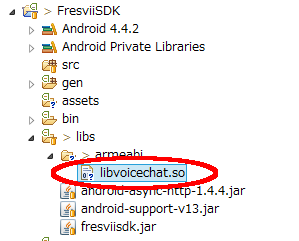
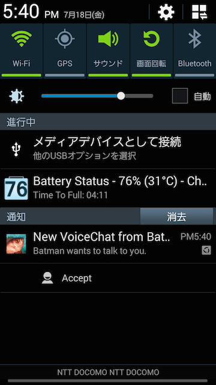

Fresvii Gaming Cloud SDK for Android
=============================

VoiceChat Getting Started
---------------------


Last updated on 2014.07.18

----


1. Add the VoiceChat libraries to the *libs/armeabi* folder of you *FresviiSDK* project in the Eclipse workspace.

    There are 3 libraries you have to include:
    
    - *libvoicechat.so*
    - *libsipmanager.so*
    - *libgnustl_shared.so* 

    

2. Add the following permissions to your *"AndroidManifest.xml"* file:

    ```
    <uses-permission android:name="android.permission.WAKE_LOCK" />
    <uses-permission android:name="android.permission.RECORD_AUDIO" />
    <uses-permission android:name="com.google.android.c2dm.permission.RECEIVE" />
    
    <permission
            android:name="com.example.gcm.permission.C2D_MESSAGE"
            android:protectionLevel="signature" />
    <uses-permission android:name="com.example.gcm.permission.C2D_MESSAGE" />
    <uses-permission android:name="com.example.gcm.c2dm.permission.RECEIVE" />
    ```

    These permissions are required to...
    
    - Receive GCM notifications for VoiceChat
    - Use the microphone for VoiceChat

3. Add the following Receivers and Services to your *"AndroidManifest.xml"* file: 

    ```
        <receiver
                android:name="com.fresvii.gcm.GcmBroadcastReceiver"
                android:permission="com.google.android.c2dm.permission.SEND" >
            <intent-filter>
                <action android:name="com.google.android.c2dm.intent.RECEIVE" />
                <category android:name="com.example.gcm" />
            </intent-filter>
        </receiver>
        
        <receiver
                android:name="com.fresvii.gcm.NotificationActionReceiver" >
            <intent-filter>
                <action android:name="com.fresvii.gcm.NotificationActionReceiver.intent.ACCEPT_VOICE_CHAT" />
            </intent-filter>
        </receiver>
        
        <service android:name="com.fresvii.gcm.GcmIntentService" />
    ```
    
     These Receivers are required to...
    
    - Receive GCM notifications for VoiceChat
    - Accept VoiceChat invitations via the OS notification center 

4. Implement the *UserAuthEventListener* interface, e.g. in your Activity. Then register the *GcmClient* in the  *onUserAuthEvent()* method in order to receive VoiceChat GCM notifications:

    ```
    public class MyActivity extends Activity implements UserAuthEventListener {
    
        @Override
        protected void onCreate(Bundle savedInstanceState) {
            // Any application *must* call Fresvii.start() in order to work with the Fresvii Android SDK
            Fresvii.start(super.getApplicationContext(), MainActivity.getAppropriateAppId(), APP_NAME, false, false);
        
            // Add a UserAuthEventListener
            AccountAccess.addUserAuthEventListener(this);
        
            ...
        }
    
        @Override
        public void onUserAuthEvent(String userId, UserAuthEvent event) {
            if ( event == UserAuthEvent.USER_LOGGED_IN ) {
                try {
                    // Application *may* initialize GCM client if it wants to receive GCM notifications from Fresvii server
                    // We have to be *logged in* to do this
                    GcmClient.getInstance().registerAndAddDeviceToken(MY_GCM_SENDER_ID);
                } catch ( InvalidParameterException e ) {
                    ManagedLog.e(LOG_MODULE, "Invalid parameter");
                }
            }
        }
        
        ...
    }
    ```

5. To start a VoiceChat, first you have to create a Fresvii Group, e.g. a PairGroup: 

    ```
        public void hostVoiceChatConference(String partnerUserId) {
            // First, create a Group with the partner(s) you wish to have a VoiceChat conference with
            // Here, we are using a PairGroup for a quick 1 on 1 VoiceChat
            GroupAccess.createPairGroup(partnerUserId, new CreatePairGroupCallback() {
                @Override
                public void onSuccess(FresviiGroup group) {
                    // Success! The PairGroup has been created.
                    // Now you can host a VoiceChat conference. 
                    VoiceChatConference.getInstance().host(group.getIdOrDefault(), new VoiceChatConferenceCallback() {
                        @Override
                        public void onSuccess() {
                            // Success! The partner(s) will now receive a GCM VoiceChat notification. 
                            // They can join the conference by accepting the invitation. 
                        }
                
                        @Override
                        public void onError(Throwable error) {
                          // Error handling
                        }
                    });
                }
                
                @Override
                public void onFailure(Throwable error) {
                    // Error handling
                }
            });
        }
    ```
    
6. After you hosted the VoiceChat conference, the partner(s) will receive a GCM VoiceChat notification. They can join the conference by accepting the invitation. 

    

7. Now you should be talking to your VoiceChat partner(s)!

8. Either participant (host or guests) can leave the VoiceChat conference like this:

    ```
        public void leaveVoiceChatConference() {
            VoiceChatConference.getInstance().leave(new VoiceChatConferenceCallback() {
                @Override
                public void onSuccess() {
                    // Success
                }
                
                @Override
                public void onError(final Throwable error) {
                    // Error handling
                }
            });
        }
    ```
 
9. Quick VoiceChat via the Forum's Profile:

    You can also quickly start a 1 on 1 VoiceChat by clicking the "Call" button in the partner's profile (e.g. in the Forum).
    This basically runs the same code as the sample code above.
    
    ***Warning: The UI is still experimental***
        
    
    
